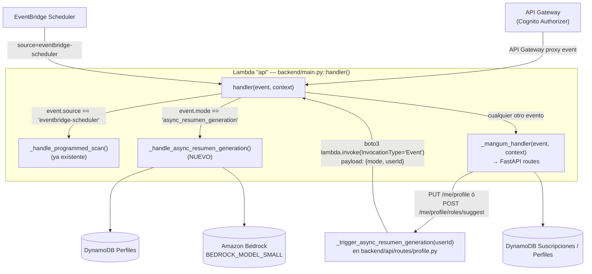
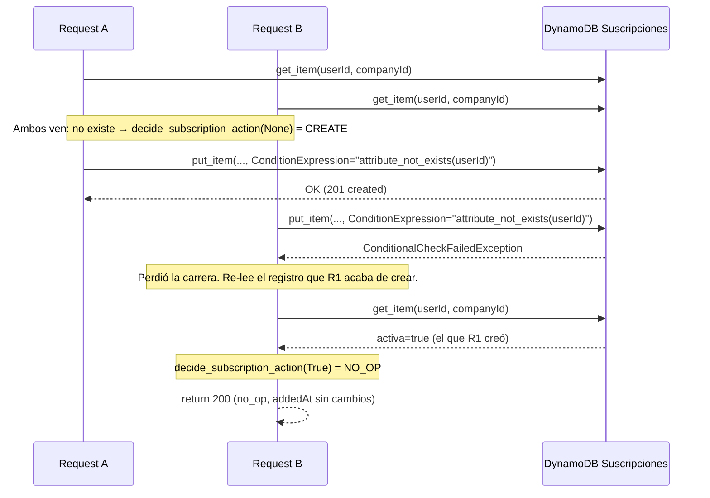

# Design Document: Backend Fix — Integración Frontend (backend-fix-integracion-frontend)

## Overview

Esta spec corrige tres desalineamientos entre el backend real y el contrato ya asumido por `frontend-spa`, más un error de prefijo de rutas. No se introduce infraestructura nueva: se reutiliza la Lambda "api" (FastAPI + Mangum monolítica), las tablas DynamoDB existentes (`Suscripciones`, `Perfiles`), y el patrón de segundo modo de invocación ya existente en `backend/main.py::handler()` (hoy usado para diferenciar EventBridge Scheduler de API Gateway/Mangum).

Los cuatro cambios, en orden de complejidad creciente de diseño:

1. **POST /me/companies/{companyId}** — alta idempotente de Suscripción (create/no_op/reactivate), con garantía de "exactamente un registro" bajo concurrencia vía `ConditionExpression` de DynamoDB (no get-then-put).
2. **PUT /me/profile** — disparo asíncrono de generación de `resumenParaMatching`, reutilizando la Lambda "api" con un segundo payload discriminador (`mode: "async_resumen_generation"`), análogo al ya existente `source: "eventbridge-scheduler"`.
3. **POST /me/profile/roles/suggest** — corrección del criterio de bloqueo HTTP 424, extraído a una función pura de decisión, con efecto secundario de retry automático en el caso `resumenParaMatching is None AND status == 'failed'`, reutilizando el mismo mecanismo de invocación asíncrona del punto 2.
4. **Prefijo de rutas** — `roles_router` pasa de `/me/roles` a `/me/profile/roles`.

Los puntos 2 y 3 comparten una única función auxiliar (`_trigger_async_resumen_generation`) para no duplicar la lógica de disparo, según lo exigido por el Requirement 3 (helper compartido entre `save_profile` y `suggest_roles`).

**Fuera de alcance** (ver Exclusiones de `requirements.md`): permisos IAM de auto-invocación (`lambda:InvokeFunction` sobre sí misma) — se documentan aquí como dependencia externa hacia `backend-fix-despliegue`, no se tocan en esta spec.

---

## Architecture

No hay cambios arquitectónicos: sigue siendo una sola Lambda "api" (FastAPI + Mangum) detrás de API Gateway con Cognito Authorizer, con DynamoDB como único almacén. El único cambio arquitectónico es que la Lambda "api" adquiere un **tercer modo de invocación** (además de API Gateway/Mangum y EventBridge Scheduler): auto-invocación asíncrona para generar `resumenParaMatching`.



La auto-invocación es "fire and forget" desde el punto de vista del request HTTP: `PUT /me/profile` y `POST /me/profile/roles/suggest` nunca esperan el resultado de la generación del resumen.

---

## Components and Interfaces

### 1. Alta idempotente de Suscripción — `backend/api/routes/companies.py`

#### 1.1 Función pura de decisión

Reutiliza el mismo router (`subscriptions_router`, prefix `/me/companies`) ya definido en `companies.py`. Se agrega una función pura, sin dependencias de AWS, junto al resto del código del router (mismo patrón que los helpers `_prepare_cv_parsing_prompt` en `profile.py`):

```python
from enum import Enum

class SubscriptionAction(str, Enum):
    """Resultado de la decisión de alta idempotente. Requirement 1.6."""
    CREATE = "created"
    NO_OP = "no_op"
    REACTIVATE = "reactivated"


def decide_subscription_action(existing_activa: Optional[bool]) -> SubscriptionAction:
    """
    Decide qué acción tomar sobre una Suscripción dado su estado actual.

    Pura: no llama a DynamoDB, no tiene efectos secundarios. Requirement 1.6.

    Args:
        existing_activa:
            - None  → no existe registro de Suscripción para (userId, companyId)
            - True  → existe registro con activa=True
            - False → existe registro con activa=False

    Returns:
        SubscriptionAction.CREATE      si existing_activa is None       (Req 1.3)
        SubscriptionAction.NO_OP       si existing_activa is True       (Req 1.4)
        SubscriptionAction.REACTIVATE  si existing_activa is False      (Req 1.5)
    """
    if existing_activa is None:
        return SubscriptionAction.CREATE
    if existing_activa is True:
        return SubscriptionAction.NO_OP
    return SubscriptionAction.REACTIVATE
```

#### 1.2 Garantía de "exactamente un registro" bajo concurrencia (Requirement 1.8)

Se evaluó **get-then-put** (leer con `get_item`, decidir, luego `put_item`/`update_item`) contra **escritura condicional** (`ConditionExpression`). Se descarta get-then-put porque deja una ventana entre la lectura y la escritura donde dos requests concurrentes pueden ambos observar "no existe" y ambos ejecutar `put_item`, creando (en el mejor caso) dos escrituras redundantes que silenciosamente machacan `addedAt` la una a la otra, sin ninguna señal de error. Esto es exactamente la clase de condición de carrera que `ConditionExpression` está diseñado para prevenir de forma atómica en DynamoDB, y es el patrón idiomático recomendado por AWS para "crear solo si no existe" — consistente con la regla de idempotencia ya aplicada a los workers de SQS en el resto del sistema (`pitfalls.md`: "los workers deben ser IDEMPOTENTES").

Diseño ("compare-and-swap" con fallback):



Pseudocódigo del endpoint:

```python
@subscriptions_router.post(
    "/{company_id}",
    response_model=SubscriptionUpsertResponse,
)
async def create_subscription(
    company_id: str,
    response: Response,
    user_id: str = Depends(get_current_user_id),
):
    """
    Alta idempotente de Suscripción (create-or-reactivate).

    Endpoint: POST /me/companies/{companyId}
    Auth: Required (JWT)

    Response:
        - HTTP 201 si se crea por primera vez (SubscriptionAction.CREATE)
        - HTTP 200 si no-op (ya activa) o reactivate (estaba inactiva)

    Error Responses:
        - HTTP 404: companyId no existe en el catálogo Empresas (company_not_found)
        - HTTP 500: fallo de escritura en DynamoDB (subscription_write_failed)

    Requirements: 1.1-1.9
    """
    # 1. companyId debe existir en Empresas (Req 1.2) — 404, NO 400
    #    (distinto del 400 que usa PUT /me/companies/{companyId} para el mismo
    #    error_code; ver nota en Error Handling sobre CompanyNotFound(http_status=...))
    empresas_table = ...
    if empresa no encontrada:
        raise CompanyNotFound(company_id=company_id, http_status=404)

    suscripciones_table = ...
    existing = suscripciones_table.get_item(Key={"userId": user_id, "companyId": company_id}).get("Item")
    existing_activa = existing.get("activa") if existing else None
    action = decide_subscription_action(existing_activa)

    now = datetime.now(timezone.utc).isoformat().replace("+00:00", "Z")

    try:
        if action == SubscriptionAction.CREATE:
            try:
                suscripciones_table.put_item(
                    Item={"userId": user_id, "companyId": company_id, "activa": True, "addedAt": now},
                    ConditionExpression="attribute_not_exists(userId)",
                )
                response.status_code = 201
                added_at = now
            except ClientError as e:
                if e.response["Error"]["Code"] == "ConditionalCheckFailedException":
                    # Perdimos la carrera: re-leer y re-decidir (Req 1.8)
                    existing = suscripciones_table.get_item(
                        Key={"userId": user_id, "companyId": company_id}
                    )["Item"]
                    action = decide_subscription_action(existing["activa"])
                    # action ahora es NO_OP o REACTIVATE; cae a las ramas de abajo
                    added_at = _apply_no_op_or_reactivate(action, existing, suscripciones_table, user_id, company_id, now)
                    response.status_code = 200
                else:
                    raise SubscriptionWriteFailed()
        else:
            added_at = _apply_no_op_or_reactivate(action, existing, suscripciones_table, user_id, company_id, now)
            response.status_code = 200
    except ClientError:
        raise SubscriptionWriteFailed()

    logger.info("create_subscription_result", context={
        "user_id": user_id, "company_id": company_id, "action": action.value,
    })
    return SubscriptionUpsertResponse(companyId=company_id, activa=True, addedAt=added_at)
```

Donde `_apply_no_op_or_reactivate` es un helper interno (no puro, hace I/O) que:
- Para `NO_OP`: no escribe nada, retorna el `addedAt` ya almacenado sin cambios (Req 1.4).
- Para `REACTIVATE`: hace `update_item` con `SET activa = :true, addedAt = :now` (mismo patrón que la rama de reactivación de `toggle_subscription`, Req 1.5), retorna `now`.

Cualquier `ClientError` no relacionado con `ConditionalCheckFailedException` (throttling, fallo de red, etc.) en cualquiera de las escrituras se traduce a HTTP 500 `subscription_write_failed` (Req 1.9), sin dejar un registro parcialmente escrito — las operaciones (`put_item` condicional, `update_item`) son atómicas a nivel de item en DynamoDB, por lo que no existe un estado "a medio escribir" posible.

#### 1.3 Modelo de respuesta

```python
class SubscriptionUpsertResponse(BaseModel):
    """Response para POST /me/companies/{companyId}."""
    companyId: str
    activa: bool  # siempre true en la respuesta exitosa
    addedAt: str
```

#### 1.4 Logging (Requirement 1.7)

```python
logger.info("create_subscription_result", context={
    "user_id": user_id,
    "company_id": company_id,
    "action": action.value,  # "created" | "no_op" | "reactivated"
})
```
Nunca se loguea contenido de perfil/CV — consistente con el resto del código base.

---

### 2. Disparo asíncrono de `resumenParaMatching` — `backend/main.py` + `backend/api/routes/profile.py`

#### 2.1 Discriminador de payload en `handler()` (Requirement 2.2, 3.7)

`backend/main.py::handler()` ya distingue EventBridge Scheduler de Mangum vía `event.get("source")`. Se agrega una segunda rama con el mismo estilo:

```python
def handler(event, context):
    """
    Requirements: 8.1-8.4 (ya existente), 2.2, 2.3, 3.7 (nuevo)
    """
    if event.get("source") == "eventbridge-scheduler":
        return _handle_programmed_scan(event, context)
    if event.get("mode") == "async_resumen_generation":
        return _handle_async_resumen_generation(event, context)
    return _mangum_handler(event, context)
```

Payload exacto (Requirement 2.2, 2.3):
```json
{"mode": "async_resumen_generation", "userId": "<sub del JWT>"}
```

Se eligió `mode` (no `source`) como nombre de campo para no colisionar semánticamente con el discriminador ya usado para EventBridge, aunque ambos cumplen el mismo rol de "distinguir el tipo de evento no-HTTP". El payload deliberadamente **no incluye** una copia de `perfilEstructurado`: solo `userId`. Esto es lo que garantiza el Requirement 2.3 ("leer el registro de Perfiles al momento de procesar, no una foto tomada al invocar") — como el handler asíncrono vuelve a hacer `get_item` sobre `Perfiles` en el momento en que se ejecuta, cualquier guardado de perfil posterior a la invocación pero anterior al procesamiento ya queda reflejado.

#### 2.2 Helper compartido de disparo — `backend/api/routes/profile.py`

Una única función privada, usada tanto por `save_profile` (Requirement 2) como por `suggest_roles` (Requirement 3, Criterio 7), evitando duplicar la lógica de invocación + manejo de fallo de despacho:

```python
def _trigger_async_resumen_generation(user_id: str) -> str:
    """
    Dispara la generación asíncrona de resumenParaMatching invocando la propia
    Lambda "api" con InvocationType='Event'.

    Garantía de no propagación de excepciones: TODO el cuerpo de esta función
    (tanto la escritura de resumenGenerationStatus='pending' como el intento de
    lambda.invoke) está envuelto en un único try/except externo. Ningún fallo en
    ningún paso de este helper puede propagarse al caller (save_profile /
    suggest_roles) ni romper su respuesta HTTP — ese caller ya completó su
    propio trabajo principal (guardar el perfil, o evaluar el bloqueo de
    roles/suggest) antes de invocar este helper, y ese trabajo principal nunca
    debe fallar por un problema en este flujo secundario de generación de
    resumen.

    Orden de escritura (crítico para evitar una carrera con el propio worker
    asíncrono, Requirement 2 Criterios 1, 2, 10):
    1. Escribe resumenGenerationStatus='pending' PRIMERO, antes de intentar
       cualquier invocación. Esto es necesario porque, una vez despachada la
       invocación asíncrona, esa Lambda separada puede completar (escribiendo
       'complete' o 'failed') en cualquier momento — incluso antes de que este
       helper termine de ejecutarse. Si este helper escribiera su propio status
       DESPUÉS de invocar, esa escritura tardía podría sobreescribir el
       resultado correcto del worker con 'pending', dejando al usuario
       atascado indefinidamente sin que ningún retry lo detecte (el status
       nunca quedaría en 'failed').
    2. Intenta lambda.invoke(). Si el despacho se completa sin excepción, no
       se requiere ninguna escritura adicional: el status ya quedó en
       'pending' en el paso 1, que es el valor correcto mientras la
       generación está en curso.
    3. Si CUALQUIER paso anterior (la escritura de 'pending' O el invoke) lanza
       una excepción, el except externo la captura, la loguea, e intenta una
       segunda escritura que sobreescribe el status a 'failed' (Requirement
       2.10) — en este punto se asume que la generación no quedará en curso,
       es un fallo confirmado, no un estado en progreso. Esa segunda escritura
       está a su vez envuelta en su propio try/except interno: si también
       falla (ej. la misma causa de throttling que afectó al paso 1), se
       loguea ese fallo secundario y la función retorna igualmente sin
       propagar ninguna excepción.

    Compartida entre:
    - save_profile (PUT /me/profile) — Requirement 2, Criterios 1, 2, 10
    - suggest_roles (POST /me/profile/roles/suggest) — Requirement 3, Criterio 7

    Returns:
        El valor final conocido de resumenGenerationStatus tras esta función:
        'pending' si ambos pasos (escritura + invoke) tuvieron éxito; 'failed'
        si algún paso falló y la escritura de 'failed' tuvo éxito; 'unknown' si
        algún paso falló Y la propia escritura de 'failed' también falló. 'unknown'
        significa que esta función no pudo CONFIRMAR qué quedó persistido en
        DynamoDB tras el fallo — no implica necesariamente que el estado real sea
        indeterminado en la práctica. Por ejemplo, si el Paso 1 escribió 'pending'
        con éxito y solo la segunda escritura de 'failed' falló después, el valor
        realmente persistido en DynamoDB sigue siendo 'pending'; este helper
        simplemente no tiene forma de verificarlo en ese momento, de modo que
        reporta 'unknown' en vez de asumir cuál de los valores posibles quedó
        almacenado.
    """
    perfiles_table = get_dynamodb_table("DYNAMODB_TABLE_PERFILES")

    try:
        # Paso 1: 'pending' PRIMERO, antes de cualquier intento de invocar.
        perfiles_table.update_item(
            Key={"userId": user_id},
            UpdateExpression="SET resumenGenerationStatus = :status",
            ExpressionAttributeValues={":status": "pending"},
        )

        # Paso 2: intentar el despacho asíncrono.
        lambda_client = boto3.client("lambda")
        lambda_client.invoke(
            FunctionName=os.environ["AWS_LAMBDA_FUNCTION_NAME"],
            InvocationType="Event",
            Payload=json.dumps({"mode": "async_resumen_generation", "userId": user_id}).encode("utf-8"),
        )
        logger.info("async_resumen_dispatch_status", context={
            "user_id": user_id, "status": "pending",
        })
        return "pending"

    except Exception as e:
        # Paso 3: algo del bloque anterior (escritura de 'pending' o invoke)
        # falló con certeza -> intentar sobreescribir a 'failed'.
        logger.error("async_resumen_dispatch_failed", context={
            "user_id": user_id, "error_type": type(e).__name__,
        })
        try:
            perfiles_table.update_item(
                Key={"userId": user_id},
                UpdateExpression="SET resumenGenerationStatus = :status",
                ExpressionAttributeValues={":status": "failed"},
            )
            return "failed"
        except Exception as inner_e:
            # Incluso la escritura de 'failed' falló (ej. mismo throttling
            # sostenido). No se propaga: el caller nunca debe romper su
            # respuesta HTTP por este flujo secundario.
            logger.error("async_resumen_failed_status_write_also_failed", context={
                "user_id": user_id, "error_type": type(inner_e).__name__,
            })
            return "unknown"
```

**Uso en `save_profile`** (Requirement 2, Criterios 1, 2, 10): al final del flujo existente de `PUT /me/profile` (después de persistir `perfilEstructurado`/`profileVersion`/`updatedAt`, sin cambiar esa lógica), se agrega una sola línea:
```python
_trigger_async_resumen_generation(user_id)
# ... return response_data (sin cambios: solo profileVersion y updatedAt)
```

**Uso en `suggest_roles`** (Requirement 3, Criterio 7): ver sección 3 más abajo.

`os.environ["AWS_LAMBDA_FUNCTION_NAME"]` es una variable de entorno estándar que AWS Lambda inyecta automáticamente en toda función (no requiere configuración Terraform adicional ni es parte de las variables custom de `DYNAMODB_TABLE_*`/`BEDROCK_MODEL_*`); se usa para la auto-invocación en vez de hardcodear el nombre de la función.

**Nota de dependencia externa:** el permiso IAM `lambda:InvokeFunction` de la función sobre sí misma se gestiona en `backend-fix-despliegue` (ver Exclusiones). Si el permiso no existe aún, `lambda_client.invoke(...)` lanza `AccessDeniedException`, que este helper captura igual que cualquier otra excepción y traduce a `status='failed'` — no requiere manejo especial.

#### 2.3 Procesamiento asíncrono — `_handle_async_resumen_generation` en `backend/main.py`

Sigue el mismo patrón que `_handle_programmed_scan` (función privada en `main.py`, imports diferidos dentro de la función para no afectar el cold start del path síncrono):

```python
def _handle_async_resumen_generation(event: dict, context) -> dict:
    """
    Genera resumenParaMatching a partir del Perfiles actual del usuario.

    Lee el registro de Perfiles EN ESTE MOMENTO (no una foto capturada al invocar),
    invoca Bedrock (BEDROCK_MODEL_SMALL), valida con Pydantic (ResumenParaMatchingOutput),
    y persiste resumenParaMatching + resumenGenerationStatus='complete' en éxito, o
    solo resumenGenerationStatus='failed' (sin tocar resumenParaMatching previo) en fallo.

    Requirements: 2.3, 2.4, 2.5, 2.9
    """
    from backend.shared.db import get_dynamodb_table
    from backend.shared.bedrock import get_bedrock_client
    from backend.shared.models import ResumenParaMatchingOutput
    from backend.api.routes.profile import _prepare_resumen_prompt

    user_id = event.get("userId")
    logger.info("async_resumen_generation_start", context={"user_id": user_id})

    perfiles_table = get_dynamodb_table("DYNAMODB_TABLE_PERFILES")

    try:
        item = perfiles_table.get_item(Key={"userId": user_id}).get("Item")
        perfil_estructurado = item.get("perfilEstructurado") if item else None

        if not perfil_estructurado:
            raise ValueError("no perfilEstructurado available to summarize")

        prompt = _prepare_resumen_prompt(perfil_estructurado)
        bedrock_client = get_bedrock_client()
        resumen_output = bedrock_client.invoke_with_retry(
            prompt=prompt,
            response_model=ResumenParaMatchingOutput,
            model_id=bedrock_client.model_small,
            max_retries=1,
        )

        perfiles_table.update_item(
            Key={"userId": user_id},
            UpdateExpression="SET resumenParaMatching = :resumen, resumenGenerationStatus = :status",
            ExpressionAttributeValues={":resumen": resumen_output.resumen, ":status": "complete"},
        )
        logger.info("async_resumen_generation_complete", context={
            "user_id": user_id, "status_transition": "pending_to_complete",
        })
        return {"statusCode": 200, "body": {"status": "complete"}}

    except Exception as e:
        logger.error("async_resumen_generation_failed", context={
            "user_id": user_id, "error_type": type(e).__name__,
        })
        # Requirement 2.5: SHALL NOT modify the previously stored resumenParaMatching
        perfiles_table.update_item(
            Key={"userId": user_id},
            UpdateExpression="SET resumenGenerationStatus = :status",
            ExpressionAttributeValues={":status": "failed"},
        )
        return {"statusCode": 200, "body": {"status": "failed"}}
```

Nota: `_handle_async_resumen_generation` siempre retorna `statusCode: 200` en el nivel del handler Lambda (no hay caller HTTP esperando una respuesta con semántica de error — es una invocación `Event`, cuyo valor de retorno se descarta). El resultado real de la operación se refleja únicamente en `resumenGenerationStatus`.

#### 2.4 Nuevo modelo Pydantic — `backend/shared/models.py`

`backend/shared/models.py` no tiene hoy ningún modelo de salida para "resumen de perfil" (se revisó: existen `RolesSuggestions`, `PerfilEstructurado`, `CVATSOutput`, `SuggestedAnswerOutput`, pero ninguno con este propósito). Se agrega uno nuevo siguiendo el mismo patrón de una sola clase con un campo de texto:

```python
class ResumenParaMatchingOutput(BaseModel):
    """Salida de Bedrock para la generación de resumenParaMatching.

    Validada antes de persistir en Perfiles.resumenParaMatching.
    Requirements: 2.3
    """

    resumen: str = Field(..., min_length=1, description="Resumen del perfil, objetivo ≤500 palabras")

    model_config = ConfigDict(extra="ignore")
```

El límite de ≤500 palabras es una instrucción de prompt (no un `max_length` de Pydantic, porque Pydantic mide caracteres, no palabras, y el resto del código base — `CVATSOutput`, `SuggestedAnswerOutput` — tampoco impone límites de longitud vía Pydantic sobre texto generado por el LLM). El helper de generación de prompt (`_prepare_resumen_prompt`, colocado en `profile.py` junto a `_prepare_cv_parsing_prompt` y `_prepare_roles_suggestion_prompt`) incluye la instrucción "≤500 palabras" en el texto del prompt, siguiendo el mismo patrón ya usado para instruir formato JSON en los otros prompts.

#### 2.5 Actualización de documentación (Requirement 2.8)

Se actualiza `.kiro/steering/contexto-tecnico-backend.md`, sección `Perfiles` y sección "Generación asíncrona de `resumenParaMatching`": reemplazar toda referencia al campo booleano persistido `resumenGenerating` por `resumenGenerationStatus` (`'pending' | 'complete' | 'failed' | null`), aclarando que `resumenGenerating` (booleano) sigue existiendo pero **solo** como campo derivado en la respuesta HTTP de `GET /me/profile` (ya implementado así en el código actual de `profile.py`, esta spec solo corrige la documentación para que coincida).

---

### 3. Corrección del contrato de bloqueo — `backend/api/routes/profile.py`

#### 3.1 Función pura de decisión

```python
class RolesSuggestDecision(str, Enum):
    """Resultado de la decisión de bloqueo de POST /me/profile/roles/suggest. Requirement 3.4."""
    ALLOW = "allow"
    BLOCK = "block"
    BLOCK_AND_RETRY = "block_and_retry"


def decide_roles_suggest_action(
    resumen_para_matching: Optional[str],
    resumen_generation_status: Optional[str],
) -> RolesSuggestDecision:
    """
    Decide si POST /me/profile/roles/suggest debe permitir, bloquear, o bloquear
    Y disparar un retry de generación.

    Pura: no llama a DynamoDB ni a Bedrock. Requirement 3.4.

    Cubre exhaustivamente (Requirements 3.1, 3.2, 3.3, 3.6, 3.7):
        resumenParaMatching is not None                        → ALLOW
            (independientemente de resumenGenerationStatus: 'pending', 'failed',
             'complete', o None — Criterios 3.2, 3.3, 3.6)
        resumenParaMatching is None AND status == 'failed'     → BLOCK_AND_RETRY
        resumenParaMatching is None AND status != 'failed'     → BLOCK
            (incluye status is None — Criterio 3.1)
    """
    if resumen_para_matching is not None:
        return RolesSuggestDecision.ALLOW
    if resumen_generation_status == "failed":
        return RolesSuggestDecision.BLOCK_AND_RETRY
    return RolesSuggestDecision.BLOCK
```

Esto reemplaza la condición actual (`resumen is None or generation_status == "pending"`), eliminando la rama `generation_status == "pending"` como bloqueante (Requirement 3.5) — el bloqueo ahora depende únicamente de si `resumenParaMatching is None`.

#### 3.2 Integración en `suggest_roles`

```python
@roles_router.post("/suggest", response_model=dict)
async def suggest_roles(user_id: str = Depends(get_current_user_id)):
    """
    Endpoint: POST /me/profile/roles/suggest   (prefijo corregido, ver sección 4)

    Lógica de bloqueo corregida (Requirement 3):
    - resumenParaMatching existe → SIEMPRE permite (200), sin importar si
      resumenGenerationStatus es 'pending', 'failed', 'complete' o None. Una
      regeneración en curso o fallida en segundo plano NUNCA bloquea al usuario
      mientras exista un resumen previo utilizable.
    - resumenParaMatching es None Y resumenGenerationStatus == 'failed' → bloquea
      (424) Y dispara automáticamente un retry de generación asíncrona (ver
      _trigger_async_resumen_generation), dejando resumenGenerationStatus en
      'pending' (o 'failed' si el propio despacho del retry vuelve a fallar)
      antes de responder.
    - resumenParaMatching es None Y resumenGenerationStatus no es 'failed'
      (incluye None) → bloquea (424) sin disparar ningún retry.
    - Esta ruta NUNCA reintenta la llamada por su cuenta ni implementa un loop:
      dispara como máximo una invocación asíncrona por request, y responde.

    Requirements: 3.1, 3.2, 3.3, 3.4, 3.6, 3.7, 3.8, 3.9
    """
    item = perfiles_table.get_item(Key={"userId": user_id}).get("Item") or {}
    resumen = item.get("resumenParaMatching")
    generation_status = item.get("resumenGenerationStatus")

    decision = decide_roles_suggest_action(resumen, generation_status)

    if decision == RolesSuggestDecision.BLOCK_AND_RETRY:
        _trigger_async_resumen_generation(user_id)
        raise ResumeNotReady()
    if decision == RolesSuggestDecision.BLOCK:
        raise ResumeNotReady()

    # decision == ALLOW: continúa con el flujo existente (invocar Bedrock con
    # el resumen actual, validar RolesSuggestions, retornar 200) sin cambios.
    ...
```

El docstring reemplaza el texto previo que mencionaba `resumenGenerationStatus == "generating"` (Requirement 3.9) — ese literal nunca correspondió a ningún valor real escrito por el código (el chequeo real, antes de esta corrección, comparaba contra `"pending"`); se documenta la lógica corregida arriba.

---

### 4. Corrección de prefijo de rutas — `backend/api/routes/profile.py`

Cambio trivial, sin diagrama:

```python
roles_router = APIRouter(prefix="/me/profile/roles", tags=["roles"])
```

**Archivos tocados:**

| Archivo | Cambio |
|---|---|
| `backend/api/routes/profile.py` | `prefix="/me/roles"` → `prefix="/me/profile/roles"`; docstring del módulo y de `suggest_roles`/`save_roles` (reemplazar todo literal `/me/roles/suggest` → `/me/profile/roles/suggest`, `/me/roles` → `/me/profile/roles`) |
| `backend/tests/test_profile.py` | Todos los `client.post("/me/roles/suggest")` → `client.post("/me/profile/roles/suggest")`; todos los `client.put("/me/roles", ...)` → `client.put("/me/profile/roles", ...)`; docstrings de tests que mencionen la ruta vieja |
| `backend/main.py` | Sin cambio de código — ya registra `app.include_router(profile.roles_router)` sin pasar un `prefix` adicional (Requirement 4.6 ya se cumple; se deja constancia aquí, no requiere edición) |
| `frontend/openapi/openapi.json`, `frontend/src/api/generated/schema.d.ts` | Regenerados automáticamente por `python scripts/export-openapi.py` + `generate-types.sh` tras aplicar el cambio de prefijo — no se editan a mano (Requirement 4.5) |
| `.kiro/specs/backend-core/*` | NO se tocan (Requirement 4.7) |

No se toca `backend/api/routes/companies.py` ni ningún otro router.

---

## Data Models

Cambios en `backend/shared/models.py`:

```python
class ResumenParaMatchingOutput(BaseModel):
    """Salida de Bedrock para la generación de resumenParaMatching. Requirements: 2.3"""
    resumen: str = Field(..., min_length=1, description="Resumen del perfil, objetivo ≤500 palabras")
    model_config = ConfigDict(extra="ignore")
```

Sin cambios al modelo `Perfiles` (Requirement 2.6): `resumenGenerationStatus: Optional[str]` ya existente sigue siendo el único campo persistido de estado; no se agrega `resumenGenerating` (BOOL) a Pydantic ni a DynamoDB.

Nuevos tipos en `backend/api/routes/companies.py` y `backend/api/routes/profile.py` (no en `shared/models.py`, porque son tipos de decisión internos al endpoint, no modelos de dominio persistidos — igual que `SubscriptionUpdateResponse` ya vive en `companies.py` y no en `shared/models.py`):

```python
# companies.py
class SubscriptionAction(str, Enum):
    CREATE = "created"
    NO_OP = "no_op"
    REACTIVATE = "reactivated"

class SubscriptionUpsertResponse(BaseModel):
    companyId: str
    activa: bool
    addedAt: str

# profile.py
class RolesSuggestDecision(str, Enum):
    ALLOW = "allow"
    BLOCK = "block"
    BLOCK_AND_RETRY = "block_and_retry"
```

Tabla `Suscripciones`: sin cambios de esquema (`userId` PK, `companyId` SK, `activa` BOOL, `addedAt` S) — solo cambia el patrón de escritura (condicional en vez de incondicional) para el alta.

Tabla `Perfiles`: sin cambios de esquema — `resumenGenerationStatus` ya existe.

---

## Correctness Properties

*A property is a characteristic or behavior that should hold true across all valid executions of a system—essentially, a formal statement about what the system should do. Properties serve as the bridge between human-readable specifications and machine-verifiable correctness guarantees.*

Las dos funciones de decisión (`decide_subscription_action` y `decide_roles_suggest_action`) son puras, con un dominio de entrada pequeño pero con reglas que deben mantenerse exhaustiva y consistentemente — exactamente el caso de uso apropiado para property-based testing (ver Testing Strategy para justificación de por qué el resto de los cambios de esta spec NO usa PBT).

### Property 1: Decisión de alta de suscripción es exhaustiva y correcta por rama

*For any* valor de `existing_activa` en `{None, True, False}`, `decide_subscription_action(existing_activa)` retorna exactamente `CREATE` si es `None`, `NO_OP` si es `True`, o `REACTIVATE` si es `False` — y nunca ningún otro valor.

**Validates: Requirements 1.3, 1.4, 1.5, 1.6**

### Property 2: El alta de suscripción es idempotente (convergencia a no-op)

*For any* valor inicial de `existing_activa` en `{None, True, False}`, si se decide y se aplica la acción resultante (lo que siempre deja `activa=True` almacenado), entonces volver a invocar `decide_subscription_action` sobre ese nuevo estado (`True`) siempre retorna `NO_OP`.

**Validates: Requirements 1.4, 1.6** (formaliza la "Alta idempotente" del Glossary: repetir la operación sobre el mismo estado final nunca produce un efecto adicional)

### Property 3: Decisión de bloqueo de roles/suggest es exhaustiva y correcta por rama

*For any* combinación de `resumenParaMatching` (`None` o una cadena no vacía) y `resumenGenerationStatus` (`'pending'`, `'complete'`, `'failed'`, o `None`), `decide_roles_suggest_action(resumen, status)` retorna:
- `ALLOW` si `resumen is not None` (para cualquier valor de `status`)
- `BLOCK_AND_RETRY` si `resumen is None` y `status == 'failed'`
- `BLOCK` si `resumen is None` y `status != 'failed'` (incluyendo `status is None`)

**Validates: Requirements 3.1, 3.2, 3.3, 3.4, 3.6, 3.7**

### Property 4: La decisión de bloqueo de roles/suggest es independiente del contenido del resumen

*For any* dos cadenas no vacías distintas `resumen_a` y `resumen_b`, y para cualquier `status` fijo, `decide_roles_suggest_action(resumen_a, status) == decide_roles_suggest_action(resumen_b, status)`. Es decir, la decisión depende únicamente de si `resumenParaMatching` es `None`, nunca de su contenido, longitud, o valor específico.

**Validates: Requirements 3.4** (propiedad metamórfica que refuerza que la función solo distingue `None` vs. no-`None`, no el contenido — previene una regresión donde alguien accidentalmente introduzca una dependencia del contenido del resumen)

---

## Error Handling

### Cambios en `backend/shared/errors.py`

**Nueva excepción** (Requirement 1.9):

```python
class SubscriptionWriteFailed(AppException):
    """
    HTTP 500: DynamoDB write failed while creating/reactivating a Suscripción.
    """
    def __init__(self, details: Optional[str] = None):
        super().__init__(
            error_code="subscription_write_failed",
            message="Failed to write subscription record",
            http_status=500,
            details=details,
        )
```

**Modificación no disruptiva a `CompanyNotFound`** (necesaria porque el mismo `error_code` `company_not_found` debe responder con HTTP **400** desde `PUT /me/companies/{companyId}` — Requirement 9.3 de `backend-core`, sin cambios — pero con HTTP **404** desde el nuevo `POST /me/companies/{companyId}` — Requirement 1.2 de esta spec):

```python
class CompanyNotFound(AppException):
    """
    HTTP 400 (default, uso existente en toggle_subscription) o HTTP 404
    (uso en create_subscription, Requirement 1.2) según el parámetro http_status.
    """
    def __init__(self, company_id: str, details: Optional[str] = None, http_status: int = 400):
        if not details:
            details = f"Company with ID {company_id} not found"
        super().__init__(
            error_code="company_not_found",
            message="Company not found",
            http_status=http_status,
            details=details,
        )
        self.company_id = company_id
```

El valor por defecto (`400`) preserva el comportamiento exacto de todos los call sites existentes (`toggle_subscription` en `companies.py`) sin modificarlos; solo el nuevo `create_subscription` pasa explícitamente `http_status=404`.

### Tabla de códigos HTTP nuevos/afectados en esta spec

| Código | Condición | error_code |
|---|---|---|
| 201 | `POST /me/companies/{companyId}` crea por primera vez | — (sin error) |
| 200 | `POST /me/companies/{companyId}` no-op o reactivate | — (sin error) |
| 404 | `POST /me/companies/{companyId}`, companyId no existe en catálogo | `company_not_found` |
| 500 | `POST /me/companies/{companyId}`, fallo de escritura DynamoDB | `subscription_write_failed` |
| 424 | `POST /me/profile/roles/suggest`, resumen no listo (block o block_and_retry) | `resume_not_ready` (sin cambios, ya existente) |

---

## Testing Strategy

**Enfoque dual**, consistente con `pitfalls.md` ("solo funciones puras... sin suite de mocks de AWS") y con la sección "Consideraciones de Testing" ya aprobada en `requirements.md`:

### Property-based tests (Hypothesis)

Se usa **Hypothesis** (`hypothesis` — librería estándar de PBT en Python; no se implementa generación de casos desde cero). Se agrega como dependencia de desarrollo en `backend/pyproject.toml` bajo `[project.optional-dependencies].dev` (no se agrega a `requirements.txt` de producción, ya que no se usa en runtime Lambda):

```toml
dev = [
    "pytest>=7.4.0",
    "pytest-cov>=4.1.0",
    "hypothesis>=6.100.0",
    ...
]
```

Cada property test:
- Corre un mínimo de 100 ejemplos (`@settings(max_examples=100)`).
- Se etiqueta con un comentario referenciando la propiedad del diseño, formato: `# Feature: backend-fix-integracion-frontend, Property N: <texto de la propiedad>`.
- Vive en `backend/tests/test_companies.py` (Property 1, 2) y `backend/tests/test_profile.py` (Property 3, 4), junto a los tests de endpoint existentes de cada módulo — no se crean archivos de test nuevos.

Ejemplo (Property 1):
```python
from hypothesis import given, settings, strategies as st

# Feature: backend-fix-integracion-frontend, Property 1: Decisión de alta de
# suscripción es exhaustiva y correcta por rama
@settings(max_examples=100)
@given(existing_activa=st.one_of(st.none(), st.booleans()))
def test_decide_subscription_action_property(existing_activa):
    from backend.api.routes.companies import decide_subscription_action, SubscriptionAction

    action = decide_subscription_action(existing_activa)
    if existing_activa is None:
        assert action == SubscriptionAction.CREATE
    elif existing_activa is True:
        assert action == SubscriptionAction.NO_OP
    else:
        assert action == SubscriptionAction.REACTIVATE
```

Ejemplo (Property 4, metamórfica):
```python
# Feature: backend-fix-integracion-frontend, Property 4: La decisión de bloqueo
# de roles/suggest es independiente del contenido del resumen
@settings(max_examples=100)
@given(
    resumen_a=st.text(min_size=1, max_size=2000),
    resumen_b=st.text(min_size=1, max_size=2000),
    status=st.one_of(st.none(), st.sampled_from(["pending", "complete", "failed"])),
)
def test_decide_roles_suggest_action_content_independence(resumen_a, resumen_b, status):
    from backend.api.routes.profile import decide_roles_suggest_action

    assert decide_roles_suggest_action(resumen_a, status) == decide_roles_suggest_action(resumen_b, status)
```

### Unit / integration tests (ejemplo, sin PBT)

Todo lo demás de esta spec queda deliberadamente **fuera** de PBT, por las razones evaluadas en el prework:

- **Extracción de userId del JWT (1.1)**, **logging (1.7, 2.9)**, **docstrings (3.9)**, **prefijo de rutas (Requirement 4 completo)**: no varían con el input de forma interesante; un test de ejemplo (o smoke test de que la ruta existe) es suficiente y 100 iteraciones no encontrarían más bugs que 1.
- **Concurrencia real de DynamoDB (1.8)**: no se puede ejercer de forma significativa contra un `Mock()` de tabla (los mocks no modelan condiciones de carrera reales de un backend distribuido). Se cubre con: (a) un test de ejemplo que simula la rama de `ConditionalCheckFailedException` y verifica que el segundo request cae correctamente a `NO_OP`/`REACTIVATE` sin crear un segundo registro; (b) la garantía real de exactamente-un-registro depende del uso correcto de `ConditionExpression` en DynamoDB, verificado en despliegue/integración, no en esta suite.
- **Invocación real de `lambda.invoke` contra AWS (2.2, 2.10, 3.7)**: no se mockea con `moto` ni se cubre con test automatizado, según lo ya establecido en `requirements.md`. Se cubre con tests de ejemplo que mockean `boto3.client("lambda")` (y, cuando corresponda, la propia tabla `Perfiles`) y verifican, respetando el orden de escritura descrito en 2.2 (pending antes de invoke), todo el rango de resultados del try/except externo: (a) camino feliz: la escritura de `'pending'` ocurre antes del `invoke()`, y `invoke()` se llama exactamente una vez con el payload esperado; (b) si `invoke()` lanza, la respuesta HTTP del caller no falla, y hay una segunda escritura (dentro del except externo) que deja el status en `'failed'` (Requirement 2.10); (c) si la propia escritura de `'pending'` (Paso 1) lanza, ese fallo también es capturado por el mismo except externo sin propagarse — nunca se llega a invocar `invoke()` — y se intenta igualmente la segunda escritura a `'failed'`; (d) si esa segunda escritura (dentro del except interno) también falla, la función retorna `'unknown'` sin propagar ninguna excepción, y la respuesta HTTP del caller tampoco falla.
- **Flujo de generación de Bedrock en `_handle_async_resumen_generation` (2.3, 2.4, 2.5)**: tests de ejemplo con `Mock()` de Bedrock y de la tabla `Perfiles`, siguiendo el patrón ya usado en `test_profile.py` para `parse_cv`/`suggest_roles` (éxito → persiste `resumenParaMatching` + `status='complete'`; fallo de Bedrock o de validación Pydantic → `status='failed'` sin tocar el `resumenParaMatching` previo).
- **Endpoints HTTP completos** (`POST /me/companies/{companyId}`, `PUT /me/profile`, `POST /me/profile/roles/suggest`): tests de integración con `TestClient` + `Mock()` de tabla DynamoDB, siguiendo exactamente el patrón ya usado en `test_profile.py`/`test_companies.py` (sin `moto`, ya aceptado como estándar del repo).

### Resumen de cobertura por archivo

| Archivo de test | Qué cubre |
|---|---|
| `backend/tests/test_companies.py` | Property 1, Property 2 (Hypothesis); tests de ejemplo de `POST /me/companies/{companyId}` (201 create, 200 no-op, 200 reactivate, 404 company_not_found, 500 subscription_write_failed, rama de `ConditionalCheckFailedException`) |
| `backend/tests/test_profile.py` | Property 3, Property 4 (Hypothesis); tests de ejemplo de `_trigger_async_resumen_generation` (éxito/fallo de invoke); tests de ejemplo de `save_profile` disparando el trigger; tests de ejemplo actualizados de `suggest_roles` con los 4 casos de bloqueo/permiso + el caso `block_and_retry`; rutas actualizadas a `/me/profile/roles/*` |
| Nuevo, si se decide separar: `backend/tests/test_main.py` (no existe hoy — a confirmar en fase de tasks) | Tests de ejemplo de `_handle_async_resumen_generation` y del discriminador `mode` en `handler()` |

No se agrega ninguna dependencia de test más allá de `hypothesis`; se sigue usando `pytest` + `unittest.mock.Mock/patch` + `starlette.testclient.TestClient`, ya presentes en `backend/pyproject.toml` y en el código de tests existente.

---

## End of Design

**Next Steps:**
1. Usuario revisa el diseño para completitud y corrección técnica.
2. Usuario puede solicitar cambios o marcar como completo.
3. Tras aprobación, el workflow avanza a la fase de Tasks (no se genera aún).
