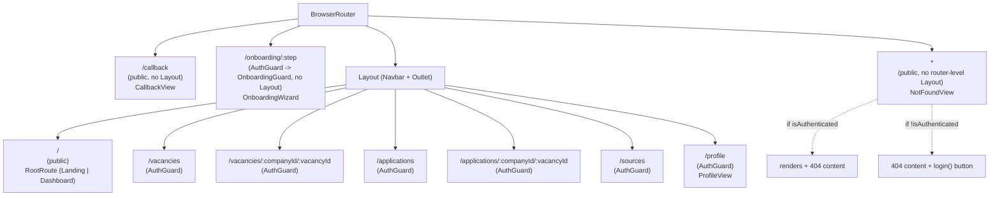
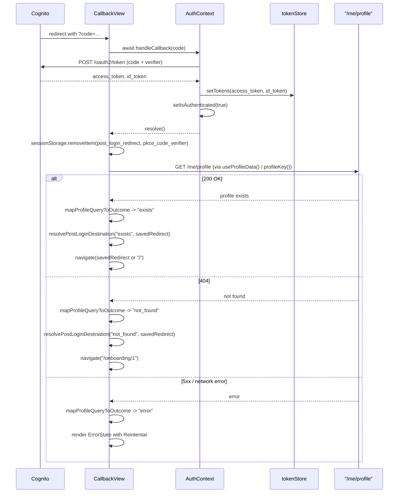

# Design Document: Frontend Navigation Architecture

## Overview

This design implements the routing, layout, and post-login navigation architecture specified in `requirements.md`. It touches four areas of the existing React + Vite + TypeScript SPA:

1. **Routing restructure** in `App.tsx` — introducing a `Layout` component (Navbar + `<Outlet/>`) that wraps a specific set of routes, a public root route with conditional rendering, and a public `NotFound` page replacing the current catch-all.
2. **AuthContext / CallbackView contract change** — `handleCallback()` stops navigating internally; `CallbackView` takes over navigation after awaiting token exchange and a profile-existence check.
3. **A new `/profile` screen** that reuses the profile-editing and roles-editing logic currently embedded in `Step1ProfileParse` and `Step2Roles`, outside the onboarding wizard shell.
4. **An onboarding guard** that redirects users with an existing profile away from `/onboarding/:step` and into `/profile`.

All new decision logic (which route redirects where, whether the Navbar shows, how the email is extracted from the `id_token`) is pushed into small, pure, synchronously-testable functions, matching the existing convention in this codebase (see `frontend/src/lib/scanResultClassifier.ts`, tested with Vitest + `fast-check`). This project has no component-rendering test library (no `@testing-library/react`) installed, and the existing test suite exclusively covers pure functions — the design deliberately keeps that constraint by extracting logic rather than adding a new test dependency.

## Architecture

### Route tree



`NotFoundView` is registered at the router's top level (path `"*"`), not inside the `Layout` route group. Requirement 7.2 requires it to show the Navbar when authenticated but never redirect through `AuthGuard`. Rather than duplicating the `Layout`/`Outlet` machinery for a single leaf page, `NotFoundView` imports and renders the standalone `<Navbar/>` component directly when `isAuthenticated` is true. This is the one deliberate exception to "only routes in Requirement 3.2's list use the Layout wrapper" — the Navbar it renders is the same component instance, not a duplicate implementation.

### Post-login navigation sequence



Both sessionStorage keys (`post_login_redirect` and `pkce_code_verifier`) are cleared immediately after `handleCallback()` resolves successfully (token exchange completed), BEFORE the profile check runs — regardless of whether the subsequent profile check succeeds, returns `not_found`, or fails with an error. Once the token exchange has occurred, neither key is needed for any later retry: a retry on the error branch only re-runs the profile check (via `useProfileCheckStatus()`'s refetch), never a fresh login.

### Decision: `useNavigate()` vs `window.location.href` (Requirement 8.2)

**Decision: use `useNavigate()`.** The `AuthProvider` already sits above `CallbackView` in the component tree and its `isAuthenticated` state is updated synchronously inside `handleCallback()` before it resolves. A full page reload (`window.location.href`) would re-mount `AuthProvider` and re-derive `isAuthenticated` from `tokenStore` again — redundant, and it discards the in-memory React Query cache and causes a visible flash. There is no session/state-consistency reason that requires a full reload: tokens are already persisted to `sessionStorage` (survives reload or not), and React context state is already correct. `useNavigate()` is used for all three destinations (`/onboarding/1`, saved redirect, `/`).

## Components and Interfaces

### New pure logic modules (property-tested)

| Module | Export | Responsibility |
|---|---|---|
| `frontend/src/lib/postLoginRedirect.ts` | `resolvePostLoginDestination(profileStatus: "exists" \| "not_found", savedRedirect: string \| null): string` | Requirement 2.3/2.4/6.2 decision. `not_found` always yields `"/onboarding/1"` regardless of `savedRedirect`; `exists` yields `savedRedirect` when it's a non-empty string, else `"/"`. |
| `frontend/src/lib/navbarRoutes.ts` | `isNavbarRoute(pathname: string): boolean` | Requirement 3.2/3.3/7.3. Uses `matchPath` from `react-router-dom` against the fixed pattern list `["/", "/vacancies", "/vacancies/:companyId/:vacancyId", "/applications", "/applications/:companyId/:vacancyId", "/sources", "/profile"]`. |
| `frontend/src/lib/onboardingGuard.ts` | `resolveOnboardingGuardAction(profileStatus: "exists" \| "not_found"): "redirect_to_profile" \| "render"` | Requirement 5.2. Deliberately takes no `:step` parameter — the guard's outcome must not depend on which onboarding step was requested. |
| `frontend/src/auth/idTokenClaims.ts` | `decodeIdToken(idToken: string): Record<string, unknown> \| null`, `getEmailFromIdToken(idToken: string): string \| null` | Requirement 4.6. Base64url-decodes the JWT payload segment (no signature verification needed client-side — the access token, not the id token, authorizes API calls). Returns `null` on malformed input instead of throwing, since this feeds UI display only. |
| `frontend/src/auth/tokenExchange.ts` | `extractTokensFromResponse(body: unknown): { accessToken: string; idToken: string }` | Requirement 8.1. Pulled out of `AuthContext.handleCallback` so the "extract-or-throw" contract is unit/property-testable without rendering the provider. Throws when `access_token` or `id_token` is missing/empty, matching today's `handleCallback` error behavior. |
| `frontend/src/api/profileCheck.ts` | `mapProfileQueryToOutcome(result: { data: MeProfile \| undefined; error: unknown; isError: boolean; isLoading: boolean }): ProfileCheckOutcome` | Pure mapping function, no fetch of its own: checks `isLoading` FIRST, returning `{status:"loading"}` before evaluating `data`/`error`/`isError` at all; otherwise, `data` present → `{status:"exists"}`; `isError` with an HTTP 404 → `{status:"not_found"}`; any other error (5xx, network) → `{status:"error", message: string}`. Consumed only through `useProfileCheckStatus()` (below), so the loading/200/404/error mapping is defined once and shared by `CallbackView` (Req 2) and `OnboardingGuard` (Req 5.2). |
| `frontend/src/api/queries/useProfileData.ts` | `useProfileData(): UseQueryResult<MeProfile>` | The single real query for `GET /me/profile`, keyed with `profileKey()`. This is the only place that fetches profile data — `ProfileView` reads it directly for the full payload (`perfilEstructurado`, `cargosActivos`). |
| `frontend/src/api/queries/useProfileCheckStatus.ts` | `useProfileCheckStatus(): ProfileCheckOutcome` | Thin derived hook: calls `useProfileData()` (same `profileKey()`, no duplicate `queryFn`) and passes its `{data, error, isError}` through `mapProfileQueryToOutcome`. Implemented as a plain wrapper (not a TanStack `select`) since the mapping needs `error`/`isError` in addition to `data`, and a `select` only transforms `data`. `CallbackView` and `OnboardingGuard` both consume this hook, never a parallel query under the same key. |

### Modified: `frontend/src/auth/AuthContext.tsx`

`handleCallback` is rewritten to delegate token exchange to `exchangeCodeForTokens` (a thin async wrapper in `tokenExchange.ts` around the existing `fetch` call, using `extractTokensFromResponse` for parsing) and drops the trailing navigation block entirely:

```ts
const handleCallback = useCallback(
  async (code: string) => {
    const codeVerifier = sessionStorage.getItem("pkce_code_verifier");
    if (!codeVerifier) {
      throw new Error("Missing PKCE code_verifier in session");
    }
    const { accessToken, idToken } = await exchangeCodeForTokens({
      cognitoDomain, clientId, redirectUri, code, codeVerifier,
    });
    tokenStore.setTokens(accessToken, idToken);
    setIsAuthenticated(true);
    // No navigation here — CallbackView owns post-login routing (Requirement 8.1/8.2).
  },
  [cognitoDomain, clientId, redirectUri],
);
```

Clearing `post_login_redirect` / `pkce_code_verifier` moves to `CallbackView`, since `handleCallback` no longer knows the eventual destination.

### Modified: `frontend/src/screens/auth/CallbackView.tsx`

Adds a `useEffect` chain (or an async IIFE inside the existing effect) that:
1. Awaits `handleCallback(code)`, then immediately clears the two `sessionStorage` keys (`post_login_redirect`, `pkce_code_verifier`) — this happens unconditionally once token exchange succeeds, before the profile check runs. This clearing depends only on `handleCallback()` having resolved successfully; it does not depend on the profile-check outcome in any way — not on `"exists"`/`"not_found"`, not on `"error"`, and not on `"loading"` either. By the time this step runs, `useProfileCheckStatus()` has not even been read yet.
2. Reads `useProfileCheckStatus()` for the resulting outcome. While `outcome.status === "loading"`, `CallbackView` continues showing the same "Autenticando..." state it already renders today (no new component is introduced for this) — it does not navigate yet and waits for the query to settle.
3. On `error` status → sets local error state (reuses the existing `ErrorState` component with `onRetry` re-invoking the query's refetch — Requirement 10.1/10.2).
4. On `exists`/`not_found` → calls `resolvePostLoginDestination` (or `"/onboarding/1"` directly for `not_found`), then `navigate(destination, { replace: true })`.
5. The existing `.catch()` on `handleCallback` itself is unchanged in spirit (Requirement 8.3) — it must short-circuit before any profile check runs, which the sequential `await`/`try-catch` structure guarantees. `sessionStorage` is not cleared on this branch since token exchange never completed.

All errors (token exchange failure, profile-check failure) are logged via a small `logStructuredError(event: string, detail: unknown)` helper (`console.error(JSON.stringify({event, ...}))`) — Requirement 10.4. No CV text or profile content ever appears in these logs, consistent with the workspace-wide logging rule.

### New: `frontend/src/components/Navbar.tsx`

Renders the three-section layout from Requirement 3.4. Reads `isAuthenticated`, `login`, `logout` from `useAuth()`. The center links (`Vacantes`, `Postulaciones`, `Fuentes`) and the `Perfil` link render only when `isAuthenticated`; the right section swaps between `Iniciar sesión` and `Perfil` + `Cerrar sesión`. A `<button>` with `aria-expanded`/`aria-controls` collapses the center links into a disclosure panel below `md` breakpoint (Requirement 9.4) — no JS-driven media query needed, pure Tailwind responsive classes (`hidden md:flex` + a `useState` toggle for the mobile panel).

### New: `frontend/src/components/Layout.tsx`

```tsx
export function Layout() {
  return (
    <>
      <Navbar />
      <Outlet />
    </>
  );
}
```

Used only as the `element` of the parent `<Route>` wrapping the Requirement 3.2 route list in `App.tsx`.

### New: `frontend/src/screens/home/LandingPage.tsx`, `Dashboard.tsx`, `RootRoute.tsx`

`RootRoute` is the element mounted at `"/"`: reads `isAuthenticated` from `useAuth()` and renders `<LandingPage/>` or `<Dashboard/>` (Requirement 1.2/1.4). `LandingPage` renders the static marketing copy + logo + "Iniciar sesión" button calling `login()` (Requirement 1.3). `Dashboard` decodes the email via `getEmailFromIdToken(tokenStore.getIdToken())` for the greeting and renders two quick-access links to `/vacancies` and `/applications` (Requirement 1.5).

### New: `frontend/src/screens/NotFoundView.tsx`

Public, unguarded. Reads `isAuthenticated` from `useAuth()`:
- Always renders a "Volver al inicio" link to `/`.
- If unauthenticated, additionally renders an "Iniciar sesión" button calling `login()` (Requirement 7.2).
- If authenticated, renders `<Navbar/>` above its content (Requirement 7.2/3 consistency) instead of being unguarded blank space.

### New: `frontend/src/screens/onboarding/OnboardingGuard.tsx`

Wraps `OnboardingWizard` inside the `/onboarding/:step` route, itself nested inside `AuthGuard`:

```tsx
export function OnboardingGuard({ children }: { children: ReactNode }) {
  const outcome = useProfileCheckStatus();
  if (outcome.status === "loading") return <LoadingSpinner />;
  if (outcome.status === "error") return <ErrorState message={outcome.message} onRetry={...} />;
  const action = resolveOnboardingGuardAction(outcome.status === "exists" ? "exists" : "not_found");
  if (action === "redirect_to_profile") return <Navigate to="/profile" replace />;
  return <>{children}</>;
}
```

`useProfileCheckStatus()` wraps `useProfileData()`, keyed with the existing `profileKey()` from `queryKeys.ts` — the same query instance is reused as-is by `ProfileView` (Requirement 4) so both screens share one cache entry under one shape (`MeProfile`), never `ProfileCheckOutcome`.

### New: `frontend/src/screens/profile/ProfileView.tsx`

Composes two reused sections (Requirement 4.5) and the read-only email (Requirement 4.6):

```tsx
export function ProfileView() {
  const { data: profile } = useProfileData(); // GET /me/profile — full payload incl. perfilEstructurado, cargosActivos
  const email = getEmailFromIdToken(tokenStore.getIdToken() ?? "");
  return (
    <div className="mx-auto max-w-2xl px-4 py-6 space-y-8">
      <h1 className="text-lg font-semibold text-gray-900">Perfil</h1>
      <p className="text-sm text-gray-500">{email}</p>
      <section>
        <h2>Información de perfil</h2>
        <Step1ProfileParse initialProfile={profile.perfilEstructurado} onSaveSuccess={() => toast(...)} />
      </section>
      <section>
        <h2>Cargos activos</h2>
        <Step2Roles initialSelectedRoles={profile.cargosActivos} onSaveSuccess={() => toast(...)} />
      </section>
    </div>
  );
}
```

No wizard header, no step navigation, no `Step3Companies`/`Step4Scan` — those simply aren't imported (Requirement 4.4). No name field is rendered anywhere (Requirement 4.7).

**Required refactors to `Step1ProfileParse` and `Step2Roles` for reuse (Requirement 4.3):**

Today both components hard-code (a) starting phase/state and (b) the post-save `navigate("/onboarding/2")` / `navigate("/onboarding/3")` call. Duplicating their ~250 lines of form/validation logic into `ProfileView` would violate 4.3 ("without duplication"), so both gain two optional props instead:

- `Step1ProfileParse({ initialProfile?: PerfilEstructurado; onSaveSuccess?: () => void })`
  - When `initialProfile` is provided, the component skips the `"input"`/`"split"` phases (CV pasting + reveal animation) entirely and initializes `phase` to `"edit"` with `parsedProfile` pre-set to `initialProfile` — there is no CV text to re-parse; the user is editing already-structured data.
  - `handleSave`'s `onSuccess` calls `onSaveSuccess?.() ?? navigate("/onboarding/2")`, preserving current wizard behavior when the prop is omitted.
- `Step2Roles({ initialSelectedRoles?: string[]; onSaveSuccess?: () => void })`
  - When `initialSelectedRoles` is provided, `selectedRoles` initializes from it instead of `[]`, and the component still calls the AI suggestion endpoint on mount (same "Section 2: Active Job Roles" experience — suggestions augment, not replace, the existing selection) but does not clear pre-existing selections.
  - `saveRolesMutation`'s `onSuccess` calls `onSaveSuccess?.() ?? navigate("/onboarding/3")`.

Both changes are backward-compatible: `OnboardingWizard`'s existing usage (`<Step1ProfileParse/>`, `<Step2Roles/>` with no props) is unaffected.

### Modified: `frontend/src/App.tsx`

Route tree reorganized per the diagram above: `Layout` wraps `/`, `/vacancies`, `/vacancies/:companyId/:vacancyId`, `/applications`, `/applications/:companyId/:vacancyId`, `/sources`, `/profile` (each individually still wrapped in `AuthGuard` except `/`); `/callback` and `/onboarding/:step` stay outside `Layout` (full-screen, Requirement 3.3); `path="*"` renders the new public `NotFoundView`, replacing the current `AuthGuard`-wrapped `CatchAllPage`.

## Data Models

```ts
// frontend/src/api/profileCheck.ts
export type ProfileCheckOutcome =
  | { status: "loading" }
  | { status: "exists" }
  | { status: "not_found" }
  | { status: "error"; message: string };

// frontend/src/lib/postLoginRedirect.ts / onboardingGuard.ts
export type ProfileStatus = "exists" | "not_found";

// frontend/src/auth/tokenExchange.ts
export interface ExchangedTokens {
  accessToken: string;
  idToken: string;
}
```

`ProfileStatus` intentionally stays a 2-variant type (`"exists" | "not_found"`) and does NOT gain `"loading"`/`"error"` variants, even though `ProfileCheckOutcome` (its 4-variant superset) has them. `resolvePostLoginDestination` and `resolveOnboardingGuardAction` — the two pure functions that take `ProfileStatus` as input — never receive `"loading"` or `"error"` as arguments: their callers (`CallbackView`, `OnboardingGuard`) already branch on and handle those two cases before calling either function, so by the time a `ProfileStatus` reaches them, only `"exists"`/`"not_found"` remain. Widening `ProfileStatus` to 4 variants would force both functions' property tests to generate `"loading"`/`"error"` inputs that correspond to no business decision at all, without adding any real coverage.

`PerfilEstructurado` and the `/me/profile` response shape (`MeProfile`) are already defined in `frontend/src/api/types.ts` / the generated OpenAPI schema and are reused as-is — no new domain model is introduced for profile data itself. `ProfileCheckOutcome` is derived from `MeProfile` via `mapProfileQueryToOutcome`, not fetched independently; `useProfileData()` (returning `MeProfile`) and `useProfileCheckStatus()` (returning `ProfileCheckOutcome`) share the single `profileKey()` cache entry but expose different shapes to their respective callers — there is no query that stores `ProfileCheckOutcome` in the cache itself.

## Correctness Properties

*A property is a characteristic or behavior that should hold true across all valid executions of a system-essentially, a formal statement about what the system should do. Properties serve as the bridge between human-readable specifications and machine-verifiable correctness guarantees.*

### Property 1: Post-login destination resolution

For any saved redirect value (including `null`, empty string, or an arbitrary non-empty path+query string) and for any profile-check outcome of `"exists"` or `"not_found"`, `resolvePostLoginDestination` SHALL return `"/onboarding/1"` whenever the outcome is `"not_found"` regardless of the saved redirect, and SHALL return the saved redirect when the outcome is `"exists"` and the saved redirect is a non-empty string, or `"/"` when the outcome is `"exists"` and the saved redirect is `null`/empty.

**Validates: Requirements 2.3, 2.4, 6.2**

### Property 2: Navbar route matching is total and correct

For any pathname built by substituting arbitrary non-empty string segments into `"/vacancies/:companyId/:vacancyId"` or `"/applications/:companyId/:vacancyId"`, `isNavbarRoute` SHALL return `true`; for any `:step` value substituted into `"/onboarding/:step"`, and for the literal path `"/callback"`, `isNavbarRoute` SHALL return `false`.

**Validates: Requirements 3.2, 3.3, 7.3**

### Property 3: ID token email round-trip

For any non-empty email string, encoding it as the `email` claim of a JWT-shaped payload (base64url header/payload/signature segments) and then decoding it with `getEmailFromIdToken` SHALL return exactly that email string.

**Validates: Requirements 4.6**

### Property 4: Onboarding guard action is independent of the requested step

For any onboarding `:step` value and any profile-check outcome of `"exists"` or `"not_found"`, `resolveOnboardingGuardAction` SHALL return `"redirect_to_profile"` when the outcome is `"exists"` and `"render"` when the outcome is `"not_found"`, with the result depending only on the profile-check outcome and never on the step value.

**Validates: Requirements 5.2**

### Property 5: Token extraction round-trip and failure contract

For any pair of non-empty strings used as `access_token` and `id_token` in a token-endpoint response body, `extractTokensFromResponse` SHALL return exactly those two strings as `accessToken`/`idToken`; for any response body missing one or both fields (or where either is an empty string), `extractTokensFromResponse` SHALL throw.

**Validates: Requirements 8.1**

## Error Handling

| Scenario | Requirement | Handling |
|---|---|---|
| Token exchange rejects (non-2xx from Cognito token endpoint) | 8.3, 10.3 | `CallbackView`'s existing `catch` block shows the current error UI with a `login()`-triggered retry button. No profile check runs. |
| `GET /me/profile` returns 5xx or network failure during callback | 2.5, 10.1, 10.2 | `useProfileCheckStatus()` (via `mapProfileQueryToOutcome`) maps this to `{status:"error", message}`. `CallbackView` renders `ErrorState` with a "Reintentar" button that calls the query's `refetch()` (token exchange already succeeded, no need to redo it). |
| `GET /me/profile` returns 5xx or network failure inside `OnboardingGuard` | new, derived from 5.2's error path | Same `ProfileCheckOutcome` shape from `useProfileCheckStatus()`; `OnboardingGuard` renders `ErrorState` with retry, re-running the query's `refetch()`. |
| Malformed/undecodable `id_token` when reading email | 4.6 | `decodeIdToken`/`getEmailFromIdToken` return `null` instead of throwing; `Dashboard`/`ProfileView` render a fallback (no crash) — email line is simply omitted. |
| All caught errors | 10.4 | Logged via `console.error(JSON.stringify({event, ...detail}))`, never including raw CV text or profile content, per the workspace logging rule. |

## Testing Strategy

**Unit tests** (Vitest, following the existing `frontend/src/lib/__tests__/*.test.ts` convention):
- `resolvePostLoginDestination`: explicit examples for `not_found` with a redirect present (ignored), `exists` with `null`/`""` (falls back to `"/"`).
- `isNavbarRoute`: explicit examples for each static route in the Requirement 3.2 list, plus `"/callback"` and a sample `"/onboarding/3"`.
- `resolveOnboardingGuardAction`: explicit examples for both outcomes.
- `extractTokensFromResponse`: explicit examples for a missing `id_token`, a missing `access_token`, and an empty-string token (each SHALL throw).
- `mapProfileQueryToOutcome`: explicit examples for `isLoading: true` (`"loading"`, checked first regardless of `data`/`error`/`isError` values), `data` present (`"exists"`), a 404 `error`/`isError` pair (`"not_found"`), and a 5xx/network `error`/`isError` pair (`"error"`) (Requirements 2.2, 2.5, 10.1 — example-based per the prework classification, not property-based, since the branch count is fixed and doesn't vary meaningfully with input).

**Property tests** (Vitest + `fast-check`, minimum 100 iterations each, tagged per the format below):
- Property 1 (`resolvePostLoginDestination`) — generate arbitrary redirect strings (including `null`) crossed with both outcomes.
- Property 2 (`isNavbarRoute`) — generate arbitrary non-empty alphanumeric segments substituted into the dynamic route templates, and arbitrary step strings for the negative case.
- Property 3 (`getEmailFromIdToken`) — generate arbitrary valid email-shaped strings, build a fake JWT via a small test-only base64url encoder mirroring `pkce.ts`'s `base64UrlEncode`, and assert round-trip.
- Property 4 (`resolveOnboardingGuardAction`) — generate arbitrary step strings (numeric, non-numeric, empty) crossed with both outcomes, asserting step never affects the result.
- Property 5 (`extractTokensFromResponse`) — generate arbitrary non-empty string pairs for the success case, and arbitrary partial/empty-string objects for the failure case.

Tag format used in each test file:
```ts
// Feature: frontend-navigation, Property 1: Post-login destination resolution
```

**Not covered by automated tests** (per the prework testability analysis — visual/aesthetic requirements 9.1–9.4, JSX-organization requirement 4.3's "no duplication" itself, and the "retains current implementation" requirement 5.3): these are addressed by code review and manual verification, consistent with this repository's existing convention of testing pure functions only and not introducing a component-rendering test framework.

**Mandatory manual regression check for the onboarding wizard**: because this repository has no `@testing-library/react` and no component-rendering tests, the `Step1ProfileParse`/`Step2Roles` prop refactor (adding optional `initialProfile`/`initialSelectedRoles`/`onSaveSuccess`) must be manually verified by running the full 4-step onboarding wizard end-to-end (paste CV → confirm profile, confirm roles, choose companies, first scan) AFTER the refactor is applied, confirming the default behavior (no new props passed) is identical to the current implementation. This is the ★ signature moment for the jury (contexto-tecnico-frontend.md §7.1) and cannot be considered covered by code review alone. This manual check SHALL be reflected as an explicit acceptance criterion in tasks.md when the task list is generated, not only mentioned here in the design.

**Explicitly out of scope for this design** (per the `fuera-de-alcance` product decisions): no admin UI, no changes to the onboarding wizard's four-step content, no new backend endpoints — `GET /me/profile`, `PUT /me/profile`, and `PUT /me/profile/roles` already exist and are reused unchanged.
