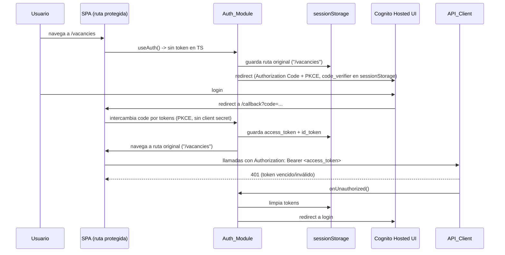
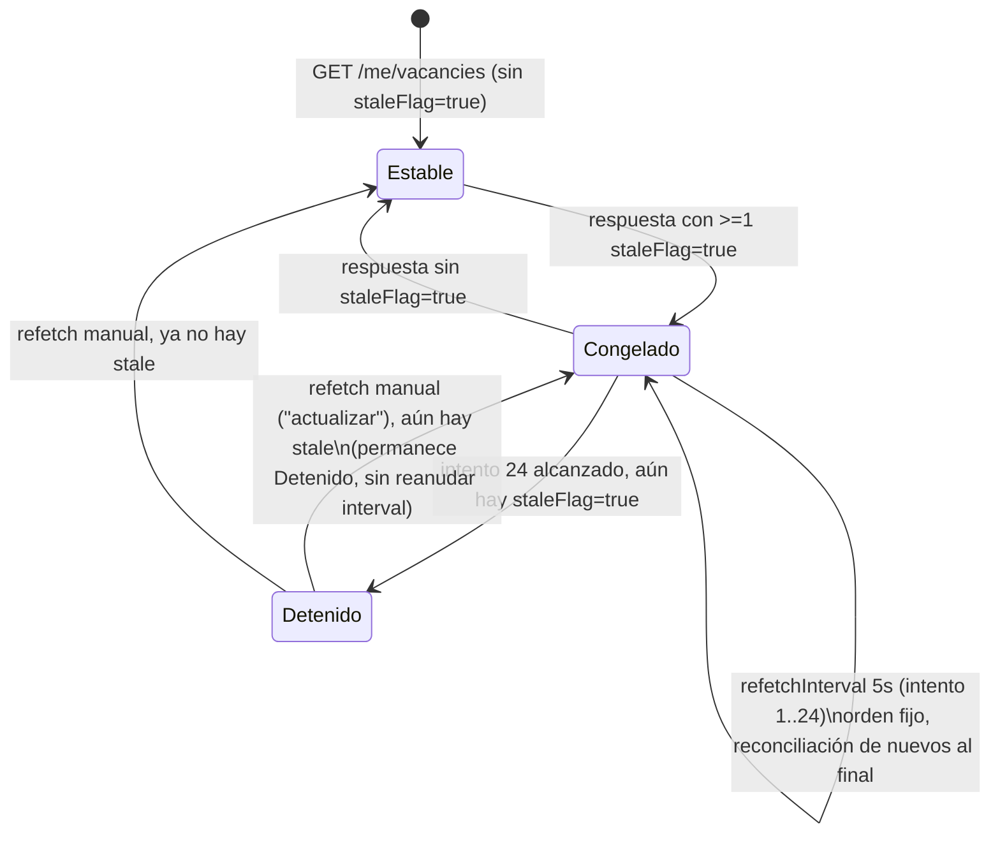

# Design Document: Frontend SPA

## Overview

Este design especifica la arquitectura de `job-search-assistant` frontend: una SPA de React + Vite +
TypeScript, estática (sin SSR), servida desde S3 + CloudFront, que consume la API REST especificada en
`backend-core`, `backend-scan-y-scoring`, y `backend-vacantes-y-notificaciones` detrás de un authorizer
de Cognito.

La spec cubre seis módulos de pantalla (Onboarding de 4 pasos, Listado de vacantes, Detalle de vacante,
Postulaciones, CV-ATS, Fuentes) más tres capas transversales: autenticación (Cognito Hosted UI +
Authorization Code con PKCE, token en `sessionStorage`), capa de acceso a datos (`API_Client` único,
tipado con `openapi-typescript`, TanStack Query para lecturas), y el sistema visual (Tailwind con tokens
de `contexto-tecnico-frontend.md` §4.2, componentes puntuales de shadcn/ui re-tematizados).

**Fuera de alcance de este design** (heredado de requirements.md): panel de administración, BYOK,
registro público, tests de componentes/end-to-end, generación de `.docx`, y cualquier re-decisión de los
6 puntos de "Dependencias externas pendientes" — este design los consume tal como quedaron documentados
en requirements.md, sin resolverlos.

## Architecture

### High-Level Components

```
┌───────────────────────────────────────────────────────────────────────────┐
│                          Navegador (pestaña única)                        │
│                                                                             │
│  ┌───────────────────────────────────────────────────────────────────┐   │
│  │                        React Router                                │   │
│  │  /callback   /onboarding/:step   /vacancies   /vacancies/:c/:v    │   │
│  │  /applications   /applications/:c/:v   /sources   /*  → guard      │   │
│  └───────────────────────────────────────────────────────────────────┘   │
│                │                    │                       │             │
│         ┌──────▼──────┐    ┌────────▼────────┐    ┌────────▼────────┐    │
│         │ Auth_Module │    │  TanStack Query  │    │  Screen modules  │    │
│         │  (Context)  │    │   QueryClient    │    │  (6 pantallas)   │    │
│         └──────┬──────┘    └────────┬────────┘    └────────┬────────┘    │
│                │                    │                       │             │
│                └────────────────────┼───────────────────────┘             │
│                                     ▼                                     │
│                          ┌─────────────────────┐                          │
│                          │      API_Client      │                         │
│                          │ (fetch wrapper único) │                         │
│                          └──────────┬──────────┘                          │
│                                     │ Authorization: Bearer <token>        │
│                                     │ (leído de sessionStorage)            │
└─────────────────────────────────────┼─────────────────────────────────────┘
                                      ▼
                    ┌──────────────────────────────────┐
                    │   API Gateway + Cognito Authorizer │
                    │   (backend-core / scan-y-scoring /  │
                    │    vacantes-y-notificaciones)       │
                    └──────────────────────────────────┘
                                      ▲
                                      │ Authorization Code + PKCE
                    ┌──────────────────────────────────┐
                    │      Cognito Hosted UI             │
                    └──────────────────────────────────┘
```

### Auth Flow (Requirement 1)



### Rescoring Freeze Flow (Requirement 8)



## Components and Interfaces

### Folder Structure

```
frontend/
├── openapi/
│   └── openapi.json                     # fuente de verdad del backend (ya existe)
├── src/
│   ├── main.tsx                         # bootstrap: QueryClientProvider, AuthProvider, Router
│   ├── App.tsx                          # define rutas
│   ├── index.css                        # @tailwind directives + fuente Inter
│   │
│   ├── api/
│   │   ├── client.ts                    # API_Client: fetch wrapper único
│   │   ├── types.ts                     # re-export de tipos generados + helpers Pick/Omit
│   │   ├── generated/
│   │   │   └── schema.d.ts              # SALIDA de `openapi-typescript` (no editar a mano)
│   │   ├── queries/                     # hooks de TanStack Query (lecturas)
│   │   │   ├── useVacancies.ts
│   │   │   ├── useVacancyDetail.ts
│   │   │   ├── useEntries.ts
│   │   │   ├── useCompanies.ts
│   │   │   ├── useSubscriptions.ts
│   │   │   ├── useProfile.ts
│   │   │   └── useScanPolling.ts        # Scan_Polling_Hook
│   │   └── mutations/                   # escrituras (POST/PUT), vía useMutation o llamada directa
│   │       ├── useApplyVacancy.ts
│   │       ├── useGenerateCvAts.ts
│   │       ├── useCreateEntry.ts
│   │       ├── useAnswerEntry.ts
│   │       ├── useToggleSubscription.ts
│   │       ├── useCreateSubscription.ts
│   │       ├── useAddCompany.ts
│   │       ├── useSaveProfile.ts
│   │       ├── useSuggestRoles.ts
│   │       └── useSaveRoles.ts
│   │
│   ├── auth/
│   │   ├── AuthContext.tsx              # Auth_Module: Context + Provider
│   │   ├── pkce.ts                      # generación code_verifier/code_challenge (funciones puras)
│   │   ├── tokenStore.ts                # wrapper de sessionStorage (Token_Store)
│   │   └── AuthGuard.tsx                # componente de ruta protegida
│   │
│   ├── lib/                             # LÓGICA PURA — corazón del arnés de Vitest (Requirement 13)
│   │   ├── scoreColorMapper.ts          # Score_Color_Mapper
│   │   ├── scanPollingExit.ts           # condición de salida del polling
│   │   ├── rescoringFreeze.ts           # Rescoring_Freeze_Logic (detección + reconciliación)
│   │   ├── cvAtsBlobBuilder.ts          # construcción de Blob + nombre de archivo
│   │   ├── scanResultClassifier.ts      # sin_novedades / fallido / nuevas_encontradas
│   │   └── __tests__/
│   │       ├── scoreColorMapper.test.ts
│   │       ├── scanPollingExit.test.ts
│   │       ├── rescoringFreeze.test.ts
│   │       ├── cvAtsBlobBuilder.test.ts
│   │       └── scanResultClassifier.test.ts
│   │
│   ├── components/
│   │   ├── ui/                          # componentes shadcn re-tematizados (Select, Command, Tabs,
│   │   │                                #   Toast, Progress, Dialog/Sheet) — copiados vía CLI, no npm
│   │   ├── VacancyCard.tsx              # tarjeta compartida (Listado + Postulaciones, Req 8 y 10)
│   │   ├── ScoreBadge.tsx               # usa Score_Color_Mapper
│   │   ├── StaleBadge.tsx               # badge "actualizando…"
│   │   ├── EmptyState.tsx               # estado vacío genérico (distinto de ErrorState)
│   │   ├── ErrorState.tsx
│   │   └── PlainText.tsx                # wrapper que garantiza texto plano (nunca dangerouslySetInnerHTML)
│   │
│   ├── screens/
│   │   ├── onboarding/
│   │   │   ├── OnboardingWizard.tsx     # contenedor de los 4 pasos + stepper
│   │   │   ├── Step1ProfileParse.tsx    # ★ momento firma — vista dividida + Framer Motion
│   │   │   ├── Step2Roles.tsx           # polling de resumenGenerating
│   │   │   ├── Step3Companies.tsx       # Command/Combobox + POST/PUT /me/companies
│   │   │   └── Step4Scan.tsx            # Scan_Polling_Hook + contador agregado
│   │   ├── vacancies/
│   │   │   ├── VacancyListView.tsx      # Listado_Vacantes_View
│   │   │   └── VacancyDetailView.tsx    # Detalle_Vacante_View + flujo "Presentarse" ★ firma
│   │   ├── applications/
│   │   │   ├── ApplicationsListView.tsx # Postulaciones_View
│   │   │   └── ApplicationDetailView.tsx# Postulacion_Detalle_View + timeline + CV_ATS_Panel
│   │   ├── sources/
│   │   │   └── SourcesView.tsx          # Fuentes_View
│   │   └── auth/
│   │       └── CallbackView.tsx         # Ruta_De_Callback
│   │
│   ├── styles/
│   │   └── tailwind.config.ts           # tokens de §4.2 de contexto-tecnico-frontend.md
│   │
│   └── vitest.setup.ts
│
├── vite.config.ts
├── vitest.config.ts
├── tailwind.config.js
├── package.json
└── tsconfig.json
```

**Regla de dependencia entre carpetas**: `lib/` no importa nada de `api/`, `auth/`, ni `components/` — son
funciones puras sin dependencias de red ni de DOM (garantiza que Requirement 13 criterio 6 se cumple por
construcción: nada en `lib/` puede depender de React Testing Library porque no depende de React).

### 1. Auth_Module

**Archivo**: `src/auth/AuthContext.tsx`, `src/auth/pkce.ts`, `src/auth/tokenStore.ts`, `src/auth/AuthGuard.tsx`.

**Responsabilidad única** (Requirement 1, Requirement 2 criterio 7): gestionar el ciclo de vida del
token, exponer `getAccessToken()` al API_Client, y reaccionar a 401 centralizadamente.

```typescript
// tokenStore.ts — Token_Store, wrapper delgado sobre sessionStorage
export const tokenStore = {
  getAccessToken: (): string | null => sessionStorage.getItem("access_token"),
  getIdToken: (): string | null => sessionStorage.getItem("id_token"),
  setTokens: (accessToken: string, idToken: string): void => {
    sessionStorage.setItem("access_token", accessToken);
    sessionStorage.setItem("id_token", idToken);
  },
  clear: (): void => {
    sessionStorage.removeItem("access_token");
    sessionStorage.removeItem("id_token");
    sessionStorage.removeItem("pkce_code_verifier");
    sessionStorage.removeItem("post_login_redirect");
  },
};
```

```typescript
// pkce.ts — funciones puras (candidatas naturales a unit test simple, no PBT: son wrappers
// deterministas sobre crypto.subtle sin "para todo" de negocio distinto de "es válido base64url")
export function generateCodeVerifier(): string { /* crypto.getRandomValues + base64url */ }
export async function generateCodeChallenge(verifier: string): Promise<string> { /* SHA-256 + base64url */ }
```

```typescript
// AuthContext.tsx (forma, no implementación completa)
interface AuthContextValue {
  isAuthenticated: boolean;
  login: () => void;          // redirige a Cognito Hosted UI, guarda ruta actual + code_verifier
  handleCallback: (code: string) => Promise<void>; // intercambio PKCE, criterio 3/12/13 de Req 1
  logout: () => void;         // limpia Token_Store + redirige a Hosted UI
}
```

**Interceptor de 401** (Requirement 1 criterio 9, Requirement 2 criterio 7): vive dentro de `API_Client`,
no en cada hook — invoca `authContext.logout()` mediante una referencia inyectada al montar `AuthProvider`
(evita import circular entre `api/client.ts` y `auth/AuthContext.tsx`):

```typescript
// api/client.ts registra el callback una sola vez desde AuthProvider
let onUnauthorized: (() => void) | null = null;
export function registerUnauthorizedHandler(handler: () => void) {
  onUnauthorized = handler;
}
```

**AuthGuard**: componente que envuelve todas las rutas salvo `/callback`; si `isAuthenticated` es falso,
invoca `login()` inmediatamente (Requirement 1 criterio 1). No renderiza ningún formulario (criterio 2).

### 2. API_Client

**Archivo**: `src/api/client.ts`. Único módulo que construye URLs, adjunta `Authorization`, y parsea el
body de la respuesta (Requirement 2 criterio 3, 4).

```typescript
import type { paths } from "./generated/schema";

const BASE_URL = import.meta.env.VITE_API_BASE_URL;

async function request<T>(path: string, init: RequestInit = {}): Promise<T> {
  const token = tokenStore.getAccessToken();
  const response = await fetch(`${BASE_URL}${path}`, {
    ...init,
    headers: {
      "Content-Type": "application/json",
      ...(token ? { Authorization: `Bearer ${token}` } : {}),
      ...init.headers,
    },
  });

  if (response.status === 401) {
    onUnauthorized?.();
    throw new ApiError(401, "Unauthorized");
  }

  if (!response.ok) {
    const body = await response.json().catch(() => null);
    throw new ApiError(response.status, body?.detail ?? response.statusText, body);
  }

  if (response.status === 204) return undefined as T;
  const contentType = response.headers.get("content-type") ?? "";
  return contentType.includes("text/plain")
    ? ((await response.text()) as unknown as T)
    : ((await response.json()) as T);
}

export const apiClient = {
  get: <T>(path: string) => request<T>(path, { method: "GET" }),
  post: <T>(path: string, body?: unknown) =>
    request<T>(path, { method: "POST", body: body ? JSON.stringify(body) : undefined }),
  put: <T>(path: string, body?: unknown) =>
    request<T>(path, { method: "PUT", body: JSON.stringify(body) }),
};

export class ApiError extends Error {
  constructor(public status: number, message: string, public body?: unknown) {
    super(message);
  }
}
```

Nota sobre `POST .../cv`: el backend responde `Content-Type: text/plain` con el body directo (ver design
de `backend-vacantes-y-notificaciones` §5) — `request<T>` detecta ese caso y devuelve el texto crudo en
vez de intentar `response.json()`.

**Generación de tipos**: `openapi-typescript frontend/openapi/openapi.json -o src/api/generated/schema.d.ts`
se ejecuta como script `predev`/`prebuild` en `package.json` (Requirement 2 criterio 1):

```json
{
  "scripts": {
    "generate:types": "openapi-typescript openapi/openapi.json -o src/api/generated/schema.d.ts",
    "predev": "npm run generate:types",
    "prebuild": "npm run generate:types"
  }
}
```

`src/api/types.ts` re-exporta con nombres de dominio y deriva variantes con `Pick`/`Omit` cuando se
necesita (Requirement 2 criterio 2), por ejemplo:

```typescript
import type { components } from "./generated/schema";

export type PerfilEstructurado = components["schemas"]["PerfilEstructurado"];
export type VacancyListItem = Pick<
  components["schemas"]["VacancyResponse"], // nombre real según openapi.json vigente
  "companyId" | "vacancyId" | "titulo" | "score" | "veredicto" | "staleFlag" | "lastSeenAt"
>;
```

Si `GET /me/vacancies`, `GET /scans/{jobId}`, o `POST /me/companies/{companyId}` no tienen todavía un
esquema en `openapi.json` en el momento de implementar (dependencias externas pendientes 1 y 2), se
declara el tipo de request/response localmente en el hook correspondiente marcado con un comentario
`// TODO(dependencia-externa-pendiente-N): eliminar cuando openapi.json expuesta el esquema real`, nunca
como sustituto permanente (Requirement 2 criterio 5).

### 3. TanStack Query — convenciones

- Un único `QueryClient` en `main.tsx`, con `staleTime` por defecto de 0 (cada pantalla define el suyo
  según necesidad; el listado usa `refetchInterval` dinámico, no `staleTime`).
- `queryKey` sigue la convención `["<recurso>", ...params]`, por ejemplo `["vacancies", estado]`,
  `["vacancy", companyId, vacancyId]`, `["scan", jobId]`, `["entries", companyId, vacancyId]`.
- Las escrituras (`POST`/`PUT`) usan `useMutation` cuando el resultado debe invalidar una query
  existente (p. ej. `POST .../apply` invalida `["vacancy", companyId, vacancyId]` y `["vacancies", "activas"]`
  vía `queryClient.invalidateQueries`); no es obligatorio (Requirement 2 criterio 6), pero es la
  convención elegida por consistencia.
- Ninguna librería de estado global se introduce; el único estado de app fuera de TanStack Query es
  `AuthContext` (Requirement 2 criterio 6, Requirement 3 criterio 9).

### 4. Scan_Polling_Hook

**Archivo**: `src/api/queries/useScanPolling.ts`. Envuelve `GET /scans/{jobId}` con `refetchInterval`
condicional y aplica el límite de 600 segundos (Requirement 7 criterios 3–7).

```typescript
export function useScanPolling(jobId: string | null) {
  const startedAtRef = useRef<number | null>(null);
  const [timedOut, setTimedOut] = useState(false);

  const query = useQuery({
    queryKey: ["scan", jobId],
    queryFn: () => apiClient.get<ScanJobStatus>(`/scans/${jobId}`),
    enabled: jobId !== null && !timedOut,
    refetchInterval: (query) => {
      if (!startedAtRef.current) startedAtRef.current = Date.now();
      if (Date.now() - startedAtRef.current > 600_000) {
        setTimedOut(true);
        return false;
      }
      const status = query.state.data?.status;
      return isScanTerminal(status) ? false : 2_000;
    },
    retry: false, // errores de red/5xx no detienen el polling (criterio 5): refetchInterval continúa
                  // programando el próximo intento cada 2s, sin backoff exponencial que cause colas
  });

  return { ...query, timedOut };
}
```

/*
**Por qué `retry: false` en lugar de `retry: true`:**
- La configuración `retry: true` activa el mecanismo de reintento exponencial de TanStack Query (backoff),
  que corre en paralelo con los intervalos fijos programados por `refetchInterval`, pudiendo generar
  intentos superpuestos o alargar el intervalo efectivo entre consultas exitosas.
- `retry: false` satisface Requirement 7 criterio 5: ante un error de red o 5xx, ese ciclo de polling
  se marca como fallido (`isError: true`), pero el siguiente ciclo se ejecuta en el intervalo
  programado (2 segundos), sin que el polling se detenga.
- **Recomendación para el test de integración** (durante implementación): simular 2-3 fallos de red
  consecutivos (mockeando `fetch` para rechazar) y verificar que:
  a) el hook sigue disparando intentos aproximadamente cada 2s (no se detiene),
  b) no hay fetches duplicados debido a superposición de timers,
  c) el conteo de requests por minuto no excede ~30 (2s × 30 = 60s).
- Si tras ese test empírico se observa comportamiento inesperado, se puede ajustar la configuración
  (ejemplo: `retryDelay: 0` o `retry: 1`), pero `retry: false` es el punto de partida más simple y predecible.
*/

`isScanTerminal` (en `src/lib/scanPollingExit.ts`) es la función pura cubierta por Property 2 — ver
Correctness Properties.

### 5. Rescoring_Freeze_Logic

**Archivo**: `src/lib/rescoringFreeze.ts`. Dos funciones puras independientes, usadas por
`VacancyListView`:

```typescript
export function hasStaleItems(items: VacancyListItem[]): boolean {
  return items.some((item) => item.staleFlag === true);
}

// Identidad de un elemento para reconciliación: companyId + vacancyId
type Key = string; // `${companyId}#${vacancyId}`

export function reconcileFrozenOrder(
  frozenOrder: VacancyListItem[],
  latest: VacancyListItem[],
): VacancyListItem[] {
  const latestByKey = new Map(latest.map((item) => [keyOf(item), item]));
  const stillPresent = frozenOrder
    .filter((item) => latestByKey.has(keyOf(item)))
    .map((item) => latestByKey.get(keyOf(item))!); // datos frescos, orden congelado
  const presentKeys = new Set(stillPresent.map(keyOf));
  const newItems = latest.filter((item) => !presentKeys.has(keyOf(item)));
  return [...stillPresent, ...newItems];
}
```

`VacancyListView` mantiene `frozenOrderRef` en un `useRef` (no en estado de TanStack Query): al recibir
una respuesta con `hasStaleItems(data) === true`, si no había congelamiento previo lo inicializa con
`data`; en respuestas subsecuentes mientras sigue habiendo stale, llama a `reconcileFrozenOrder`. Al
recibir una respuesta con `hasStaleItems(data) === false`, descarta el congelamiento y renderiza `data`
directamente (Requirement 8 criterio 9). El congelamiento vive por pestaña (`activas`/`aplicadas`) en
refs independientes (criterio 14).

### 6. CV-ATS Blob Builder

**Archivo**: `src/lib/cvAtsBlobBuilder.ts`.

```typescript
export function buildCvAtsFileName(companyId: string, vacancyId: string): string {
  const safe = (s: string) => s.replace(/[^a-zA-Z0-9_-]/g, "_").slice(0, 60);
  return `cv-ats_${safe(companyId)}_${safe(vacancyId)}.txt`;
}

export function buildCvAtsBlob(cvAtsTexto: string): Blob {
  return new Blob([cvAtsTexto], { type: "text/plain;charset=utf-8" });
}
```

`CV_ATS_Panel` usa `buildCvAtsFileName` + `buildCvAtsBlob` + `URL.createObjectURL` + un `<a download>`
efímero (Requirement 11 criterio 4-5). El botón "copiar" usa `navigator.clipboard.writeText` directo,
sin pasar por estas funciones (no hay transformación que testear ahí, solo la llamada a la Clipboard API
y su manejo de error, Requirement 11 criterio 2-3).

### 7. Scan Result Classifier

**Archivo**: `src/lib/scanResultClassifier.ts`. Usado por `SourcesView` (Requirement 12 criterios 5, 6,
11, 12) y reutilizable en `Step4Scan` si se decide compartir la semántica de "sin novedades" (aunque el
Onboarding paso 4 no muestra el conteo de vacantes nuevas per Requirement 7 criterio 8, sí puede
reusar la rama `fallido` para `status FAILED`).

```typescript
export type ScanOutcome = "sin_novedades" | "nuevas_encontradas" | "fallido";

export function classifyScanResult(status: ScanJobStatus, newVacancyCount: number): ScanOutcome {
  if (status === "FAILED") return "fallido";
  if (status === "PARCIAL" && newVacancyCount === 0) return "fallido"; // ver nota abajo
  if (newVacancyCount > 0) return "nuevas_encontradas";
  return "sin_novedades";
}
```

**Nota de diseño**: Requirement 12 criterio 12 pide un componente distinto para `PARCIAL`/`FAILED` que
para los criterios 5/11 (`DONE`). Para no perder esa distinción de tres vías dentro de una función de
dos ramas booleanas, `SourcesView` no usa directamente el resultado de `classifyScanResult` para decidir
el componente visual del caso `PARCIAL`: consulta primero `status === "PARCIAL"` de forma explícita antes
de clasificar (el `if (status === "PARCIAL" && newVacancyCount === 0) return "fallido"` de arriba es una
simplificación *solo* para el caso borde de conteo cero bajo `PARCIAL`; ver Property 7 más abajo, que
formaliza únicamente las dos fronteras que Requirement 13 criterio 5 exige explícitamente: `DONE` + count
0 → sin novedades, y `FAILED` → fallido, para cualquier conteo).

### 8. Screen Modules — mapeo a Requirements

| Módulo | Requirement | Endpoints consumidos |
|---|---|---|
| `OnboardingWizard` + 4 pasos | Req 4, 5, 6, 7 | `POST /me/profile/parse`, `PUT /me/profile`, `POST /me/profile/roles/suggest`, `GET /me/profile`, `PUT /me/profile/roles`, `GET /companies`, `POST /me/companies/{id}` (dep. pendiente 1), `PUT /me/companies/{id}`, `POST /scans`, `GET /scans/{jobId}` |
| `VacancyListView` | Req 8 | `GET /me/vacancies?estado=activas\|aplicadas` |
| `VacancyDetailView` | Req 9 | `GET /me/vacancies/{c}/{v}`, `POST .../apply`, `POST .../cv` |
| `ApplicationsListView` + `ApplicationDetailView` | Req 10 | `GET /me/vacancies?estado=aplicadas`, `GET/POST .../entries`, `POST .../entries/{id}/answer` |
| `CV_ATS_Panel` (componente, usado en Detail y Application) | Req 11 | ninguno — 100% cliente |
| `SourcesView` | Req 12 | `GET /me/companies`, `PUT /me/companies/{id}`, `POST /companies`, `POST /me/companies/{id}` (dep. pendiente 1), `POST /scans`, `GET /scans/{jobId}`, `GET /me/vacancies?estado=activas` |

### 9. Tailwind Tokens

**Archivo**: `tailwind.config.js`, copiado literal de `contexto-tecnico-frontend.md` §4.2 (colores
`primary`/`gray`/`success`/`error`/`warning`/`cancel`, familia `sans: Inter`). No se reinterpreta ningún
valor hexadecimal (Requirement 3 criterio 1). `font-mono` usado en `CV_ATS_Panel` es el stack por
defecto de Tailwind (`ui-monospace`), sin paquete adicional (Requirement 3 criterio 2).

`@fontsource/inter` se importa una vez en `main.tsx` con los pesos 400/500/600/700 (contexto §4.1).

Componentes shadcn se agregan con `npx shadcn add <componente>` según se necesiten (`select`, `command`,
`tabs`, `toast`, `progress`, `dialog`/`sheet`) y se re-tematizan en el mismo commit que se copian
(Requirement 3 criterio 4) — el checklist de re-tematización sustituye toda variable `zinc`/`slate` por
los tokens de `primary`/`gray`/semánticos antes del primer uso en una ruta real.

## Data Models

Todos los modelos de dominio (Vacante, UsuarioVacante, Empresa, Suscripcion, ScanJob, Perfiles, Entrada,
Score) ya están definidos por el backend y se consumen vía los tipos generados de `openapi-typescript`
— este design no redefine ninguno de ellos manualmente (Requirement 2 criterio 2). Los siguientes tipos
son *locales* a la SPA porque no representan un recurso de la API sino estado de UI derivado:

```typescript
// src/lib/types.ts — estado derivado, no proviene de un esquema de la API

export type ScanJobStatus = "RUNNING" | "DONE" | "PARCIAL" | "FAILED";

export interface VacancyListItem {
  companyId: string;
  vacancyId: string;
  titulo: string;
  empresa: string;
  ubicacion: string;
  modalidad: string;
  score: number | null;
  veredicto: "excelente" | "buen_encaje" | "parcial" | "bajo" | null;
  staleFlag: boolean;
  // Los 4 valores vienen de `UsuarioVacante.estado` — fuente de verdad:
  // backend-vacantes-y-notificaciones/tasks.md tarea 1.1 ("estado (nueva/vista/aplicada/filtered_out)"),
  // NO contexto-tecnico-backend.md (ese steering quedó desactualizado en este punto: menciona
  // "archivada", un valor que ninguna spec de backend ya construida —backend-core,
  // backend-scan-y-scoring, backend-vacantes-y-notificaciones— implementa en un modelo Pydantic real).
  // `filtered_out` lo persiste el Scoring_Worker cuando la vacante no pasa el Prefiltro_Cargos.
  // `GET /me/vacancies` (listado) filtra ese estado y nunca lo devuelve, pero
  // `GET /me/vacancies/{companyId}/{vacancyId}` (detalle) sí puede devolverlo, por lo que el tipo
  // debe soportarlo aquí para que el detalle no falle de tipos.
  estadoAplicacion: "nueva" | "vista" | "aplicada" | "filtered_out";
  firstSeenAt: string; // ISO 8601
  lastSeenAt: string;  // ISO 8601
  appliedAt: string | null;
}

export type BadgeColor = "success" | "primary" | "warning" | "gray";

export type ScanOutcome = "sin_novedades" | "nuevas_encontradas" | "fallido";

// Estado de autenticación persistido en Token_Store (no en un modelo de dominio del backend)
export interface StoredTokens {
  accessToken: string;
  idToken: string;
}
```

`VacancyListItem` es una proyección local derivada de la unión de `Vacante` + `UsuarioVacante` + resumen
de `Empresa` que devuelve `GET /me/vacancies` — se declara explícitamente aquí porque, al momento de
este design, ese endpoint todavía no tiene un esquema formal en `openapi.json` (dependencia externa
pendiente 2/4 del requirements.md); en cuanto el backend lo expuese, este tipo se reemplaza por
`components["schemas"]["VacancyListItem"]` generado, sin cambiar la forma que consumen los componentes.

## Correctness Properties

*A property is a characteristic or behavior that should hold true across all valid executions of a
system—essentially, a formal statement about what the system should do. Properties serve as the bridge
between human-readable specifications and machine-verifiable correctness guarantees.*

Estas propiedades cubren únicamente las cinco funciones puras que Requirement 13 exige explícitamente.
El resto de los Requirements (1–12) describe comportamiento de componentes React, red, y navegador, que
Requirement 13 criterio 6 excluye deliberadamente del arnés de PBT de esta spec — se validan por revisión
de código y prueba manual, no por property-based testing.

### Property 1: Score_Color_Mapper es una tabla determinista total

*Para todo* `veredicto` ∈ `{excelente, buen_encaje, parcial, bajo}`, `Score_Color_Mapper(veredicto)`
devuelve exactamente `success` si `veredicto = excelente`, `primary` si `veredicto = buen_encaje`,
`warning` si `veredicto = parcial`, o `gray` si `veredicto = bajo` — y ningún otro valor.

**Validates: Requirements 8.4, 13.1**

### Property 2: Condición de salida del polling de escaneo

*Para todo* valor de `status` recibido de `GET /scans/{jobId}`, la función de salida del polling
devuelve `true` (detener) si y solo si `status` ∈ `{DONE, PARCIAL, FAILED}`; para `status = RUNNING` o
cualquier otro valor no reconocido, devuelve `false` (continuar).

**Validates: Requirements 7.4, 13.2**

### Property 3: Detección de elementos desactualizados

*Para toda* lista de vacantes (incluyendo la lista vacía), `hasStaleItems(lista)` devuelve `true` si y
solo si al menos un elemento de la lista tiene `staleFlag = true`; la lista vacía siempre devuelve
`false`.

**Validates: Requirements 8.6, 13.3**

### Property 4: Reconciliación de orden preserva posiciones congeladas e inserta lo nuevo al final

*Para toda* lista congelada `frozenOrder` y toda lista nueva `latest` (donde `latest` puede omitir
elementos de `frozenOrder`, incluir los mismos elementos con datos actualizados, y/o agregar elementos
no presentes en `frozenOrder`), `reconcileFrozenOrder(frozenOrder, latest)` produce una lista donde: (a)
los elementos identificados por `companyId`+`vacancyId` presentes tanto en `frozenOrder` como en `latest`
aparecen en el mismo orden relativo en que aparecían en `frozenOrder`, con los datos (score, staleFlag,
etc.) tomados de `latest`; y (b) los elementos presentes en `latest` pero no en `frozenOrder` aparecen al
final, en el mismo orden relativo en que aparecían en `latest`.

**Validates: Requirements 8.6, 13.3**

### Property 5: El nombre de archivo del CV-ATS identifica unívocamente la vacante y el contenido del Blob es un round-trip exacto

*Para todo* `companyId`, `vacancyId`, y `cvAtsTexto` (incluyendo strings vacíos y con caracteres Unicode
arbitrarios), `buildCvAtsFileName(companyId, vacancyId)` produce un nombre de archivo que contiene una
codificación de `companyId` y una codificación de `vacancyId`, y termina en la extensión `.txt`; y leer
el contenido de `buildCvAtsBlob(cvAtsTexto)` produce un texto idéntico a `cvAtsTexto`.

**Validates: Requirements 11.5, 13.4**

### Property 6: Pares distintos de (companyId, vacancyId) producen nombres de archivo distintos

*Para todo* par de identificadores `(companyId1, vacancyId1)` y `(companyId2, vacancyId2)` tales que
`companyId1 ≠ companyId2` o `vacancyId1 ≠ vacancyId2`, `buildCvAtsFileName(companyId1, vacancyId1) ≠
buildCvAtsFileName(companyId2, vacancyId2)`.

**Validates: Requirements 11.5, 13.4**

### Property 7: Clasificación de resultado de escaneo por las fronteras de status y conteo

*Para todo* conteo de vacantes nuevas `count` ∈ `[0, 999]` y *para todo* conteo de empresas revisadas en
ese mismo rango, `classifyScanResult("DONE", count)` devuelve `"sin_novedades"` cuando `count = 0`
independientemente del conteo de empresas revisadas; y *para todo* `count` ∈ `[0, 999]`,
`classifyScanResult("FAILED", count)` devuelve `"fallido"` independientemente de `count`.

**Validates: Requirements 12.5, 12.6, 13.5**

## Error Handling

### Capa API_Client (transversal)

| Condición | Manejo |
|---|---|
| HTTP 401 en cualquier llamada | `onUnauthorized()` → `Auth_Module.logout()` → limpia Token_Store → redirige a Cognito Hosted UI (Req 1.9) |
| HTTP 4xx/5xx (no 401) | `ApiError` con `status` + `body.detail`; cada hook/pantalla decide el mensaje según Requirement correspondiente (ver tabla abajo) |
| Error de red (fetch rechaza) | Se propaga como excepción; TanStack Query lo expone vía `isError`; `Scan_Polling_Hook` lo trata como "continuar polling" (Req 7.5), el resto de queries lo muestra como `ErrorState` genérico con reintento |
| Respuesta `text/plain` inesperada donde se esperaba JSON (o viceversa) | `request<T>` decide por `Content-Type`; si el backend cambia el contrato, el error se manifiesta como parseo fallido y se trata como HTTP 502-like en la UI (mensaje genérico) |

### Por pantalla (resumen; el detalle completo vive en cada Acceptance Criteria de requirements.md)

| Pantalla | Caso de error | Comportamiento |
|---|---|---|
| Onboarding paso 1 | HTTP 413 | Mensaje de tamaño excedido, vuelve a panel único (Req 4.6) |
| Onboarding paso 1 | HTTP 400/502 | Mensaje distinto + botón reintentar (Req 4.7) |
| Onboarding paso 1 | `PUT /me/profile` falla | Conserva perfil editado, botón reintentar, no avanza (Req 4.10) |
| Onboarding paso 2 | HTTP 424 tras 30s de polling | Detiene polling, botón reintento manual (Req 5.4) |
| Onboarding paso 2 | `PUT /me/profile/roles` HTTP 400 | Muestra errores de validación por campo (Req 5.11) |
| Onboarding paso 3 | `GET /companies` falla | Bloquea avance a paso 4, botón reintentar (Req 6.2) |
| Onboarding paso 3 | selección/deselección de empresa falla | Error puntual por empresa, no afecta las demás (Req 6.5, 6.7) |
| Onboarding paso 4 | `POST /scans` falla | No inicia polling, botón reintentar (Req 7.2) |
| Onboarding paso 4 | timeout de 600s | Estado "tardando más de lo esperado" + opción de continuar (Req 7.7) |
| Listado | lista vacía | `EmptyState`, distinto de `ErrorState` (Req 8.11) |
| Detalle | HTTP 404 | Estado "vacante no encontrada" (Req 9.13) |
| Detalle | error de red/no-404 | `ErrorState` genérico + reintento (Req 9.14) |
| Detalle | `.../apply` falla dentro de una acción compuesta | Toast de error, no continúa con `.../cv` (Req 9.11) |
| Detalle | `.../apply` OK, `.../cv` falla | Toast específico, permite reintentar solo `.../cv` (Req 9.12) |
| Postulación detalle | `GET .../entries` HTTP 404 | Estado "postulación no encontrada" (Req 10.3) |
| Postulación detalle | `POST .../entries` HTTP 400 | Errores de validación, formulario abierto (Req 10.8) |
| Postulación detalle | `POST .../entries` HTTP 404 | Cierra formulario, mensaje "ya no existe", sin reintento automático (Req 10.9) |
| Postulación detalle | `.../answer` falla | Detiene loading de esa entrada, mensaje de error, no crea entrada (Req 10.12) |
| CV-ATS panel | Clipboard API falla | Mensaje de error, sin confirmación de éxito (Req 11.3) |
| CV-ATS panel | `cvAtsTexto` vacío | Estado "aún no generado" (Req 11.6) |
| Fuentes | `POST /companies` no-409 o subsecuente `POST /me/companies` falla | Error puntual por empresa, conserva búsqueda y suscripciones ya confirmadas (Req 12.13) |
| Fuentes | escaneo `FAILED`/`PARCIAL` | Componente distinto del de "sin novedades"/"nuevas encontradas" (Req 12.12) |

## Testing Strategy

### Enfoque dual

- **Vitest — lógica pura (`src/lib/*`)**: cubre las 5 funciones de Requirement 13 con property-based
  testing (ver abajo) más 1-2 casos de ejemplo por función para documentar el caso trivial/feliz.
- **Vitest — unit tests de ejemplo (`api/`, `auth/pkce.ts`)**: casos concretos donde PBT no aporta valor
  adicional: construcción de URLs del `API_Client` con un path fijo, verificación de que `pkce.ts`
  produce un `code_verifier` de longitud válida y un `code_challenge` determinista para un verifier fijo
  (round-trip contra el algoritmo SHA-256 documentado por RFC 7636). No se mockea `fetch` de forma
  extensiva — el contrato HTTP real se ejerce manualmente contra el backend desplegado, consistente con
  el criterio de "arnés de verificación para Kiro" de `contexto-tecnico-frontend.md` §1.1.
- **Fuera de esta suite**: cualquier test que monte un componente React, dependa de React Testing
  Library, Playwright, o Cypress (Requirement 13 criterio 6, heredado de "Fuera de alcance" de
  requirements.md).

### Property-Based Testing

**Librería**: `fast-check` (estándar de facto para PBT en TypeScript/JavaScript, integra directamente
con Vitest vía `fc.assert(fc.property(...))`). Se agrega como `devDependency` fijada a una versión
exacta (sin rango abierto).

**Configuración**: cada property test corre un mínimo de 100 iteraciones (`fc.assert(fc.property(...),
{ numRuns: 100 })`, o el valor por defecto de fast-check que ya es 100 — se fija explícitamente para no
depender de un default que pueda cambiar entre versiones).

**Convención de tags**: cada test de propiedad lleva un comentario inmediatamente antes del `it(...)`
con el formato exigido:

```typescript
// Feature: frontend-spa, Property 1: Score_Color_Mapper es una tabla determinista total
it("mapea cada veredicto exactamente al color de la tabla", () => {
  fc.assert(
    fc.property(fc.constantFrom("excelente", "buen_encaje", "parcial", "bajo"), (veredicto) => {
      const expected = { excelente: "success", buen_encaje: "primary", parcial: "warning", bajo: "gray" }[veredicto];
      expect(scoreColorMapper(veredicto)).toBe(expected);
    }),
    { numRuns: 100 },
  );
});
```

Cada una de las 7 Correctness Properties se implementa como un único test de property-based testing
(1:1), tal como exige la sección de Property Creation Process:

| Property | Archivo de test | Generadores fast-check clave |
|---|---|---|
| 1 | `scoreColorMapper.test.ts` | `fc.constantFrom("excelente", "buen_encaje", "parcial", "bajo")` |
| 2 | `scanPollingExit.test.ts` | `fc.oneof(fc.constantFrom("DONE","PARCIAL","FAILED"), fc.constantFrom("RUNNING"), fc.string())` con aserciones separadas para el conjunto terminal vs. el resto |
| 3 | `rescoringFreeze.test.ts` (detección) | `fc.array(fc.record({ companyId: fc.string(), vacancyId: fc.string(), staleFlag: fc.boolean() }))` |
| 4 | `rescoringFreeze.test.ts` (reconciliación) | listas generadas con `fc.array` + permutación/inserción controlada de claves nuevas vs. persistentes |
| 5 | `cvAtsBlobBuilder.test.ts` (round-trip) | `fc.string()` para `companyId`, `vacancyId`, y `cvAtsTexto` (incluye `fc.unicodeString()`) |
| 6 | `cvAtsBlobBuilder.test.ts` (no-colisión) | dos pares `(companyId, vacancyId)` generados con la restricción de que difieren en al menos un campo |
| 7 | `scanResultClassifier.test.ts` | `fc.integer({ min: 0, max: 999 })` para conteos, `fc.constantFrom("DONE","FAILED")` para status |

### Unit tests de ejemplo (complementarios, no exhaustivos)

- `scoreColorMapper`: un caso feliz explícito documentando la tabla completa como comentario legible.
- `rescoringFreeze`: caso de ejemplo con lista vacía → `hasStaleItems([]) === false` (caso edge explícito
  de Requirement 13.3, aunque también cubierto por el generador de Property 3 con arrays de longitud 0).
- `cvAtsBlobBuilder`: caso de ejemplo con `cvAtsTexto` conteniendo saltos de línea y texto multi-párrafo
  real (documentación viva de qué se espera visualmente).
- `pkce.ts`: caso de ejemplo verificando longitud del `code_verifier` (43-128 caracteres según RFC 7636)
  y que dos invocaciones sucesivas producen verifiers distintos (no determinismo esperado ahí — por eso
  no es una property test, es un ejemplo puntual sobre aleatoriedad criptográfica).

### Fuera de esta suite (recordatorio)

Ningún test de esta spec renderiza un componente React, monta el DOM, ni ejercita `fetch` contra un
servidor real o mockeado extensivamente. La verificación de los flujos de Requirements 1–12 (auth,
onboarding, listado, detalle, postulaciones, CV-ATS visual, fuentes) se realiza mediante revisión de
código contra cada Acceptance Criteria y prueba manual exploratoria antes de la demo, consistente con el
criterio de costo/tiempo de `contexto-tecnico-frontend.md` §1.1.
